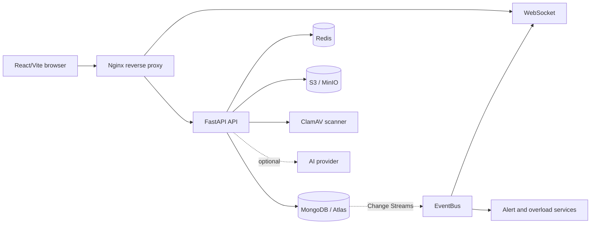

# WorkMind — HRMS AI

[](https://github.com/binbin210821-droid/HRMS_AI_Implemented/actions/workflows/ci.yml)
[](https://github.com/binbin210821-droid/HRMS_AI_Implemented/actions/workflows/security.yml)

WorkMind là hệ thống HRMS tập trung vào quản lý hiệu suất nhân viên, phát hiện sớm nguy cơ
quá tải và hỗ trợ quản lý ra quyết định dựa trên dữ liệu. Giao diện ưu tiên tiếng Việt, trong
khi backend đảm bảo phân quyền, phạm vi dữ liệu và audit ở tầng máy chủ.

> Trạng thái: hệ thống đã có pipeline CI/CD và có thể triển khai bằng Docker. Trước khi mở cho
> người dùng thật, hãy hoàn thành [production readiness checklist](#production-readiness).

## Nội dung

- [Mục tiêu và phạm vi](#mục-tiêu-và-phạm-vi)
- [Tính năng](#tính-năng)
- [Kiến trúc](#kiến-trúc)
- [Cấu trúc repository](#cấu-trúc-repository)
- [Yêu cầu](#yêu-cầu)
- [Chạy local](#chạy-local)
- [Cấu hình môi trường](#cấu-hình-môi-trường)
- [Kiểm thử và quality gates](#kiểm-thử-và-quality-gates)
- [CI/CD và phát hành](#cicd-và-phát-hành)
- [Vận hành production](#vận-hành-production)
- [Bảo mật và quyền riêng tư](#bảo-mật-và-quyền-riêng-tư)
- [Production readiness](#production-readiness)
- [Đóng góp](#đóng-góp)

## Mục tiêu và phạm vi

### Mục tiêu

- Theo dõi hiệu suất nhân viên theo ngày và theo tuần.
- Phát hiện tín hiệu chất lượng suy giảm và nguy cơ quá tải.
- Hỗ trợ quản lý xử lý cảnh báo, công việc quá hạn và điều phối nguồn lực.
- Cung cấp báo cáo tổng hợp cho Manager và Leadership.
- Dùng AI như một lớp diễn giải dữ liệu có kiểm soát, không thay thế quyết định của con người.

### Phạm vi hiện tại

- Quản lý phòng ban và nhân viên.
- Nhập, tổng hợp và trực quan hóa chỉ số hiệu suất.
- Cảnh báo ngưỡng bất lợi và phân tích quá tải.
- Đánh giá phòng ban theo tuần.
- Quản lý công việc, deadline, chỉ thị và nghiệm thu.
- Thông báo, realtime update và WebSocket.
- Lưu file evidence qua S3-compatible storage với signed URL.
- Trợ lý AI tùy chọn, có fallback, timeout, cache, audit và RBAC.

Chấm công, nghỉ phép, tuyển dụng, tiền lương và các mô hình machine learning dự đoán chuyên sâu
chưa thuộc phiên bản hiện tại.

## Tính năng

| Nhóm               | Mô tả                                                                              |
| ------------------ | ---------------------------------------------------------------------------------- |
| Hiệu suất          | Ghi nhận số công việc hoàn thành, chất lượng và điểm hiệu suất tổng hợp.           |
| Cảnh báo           | Phát hiện xu hướng bất lợi và cảnh báo quá tải theo cấu hình ngưỡng.               |
| Điều phối          | Đề xuất phân bổ lại công việc; người dùng luôn xác nhận trước khi áp dụng.         |
| Đánh giá phòng ban | Leadership đánh giá kết quả phòng ban theo tuần.                                   |
| Công việc          | Theo dõi trạng thái, deadline, chỉ thị, nghiệm thu và lịch sử thay đổi.            |
| Realtime           | MongoDB Change Streams, EventBus nội bộ và WebSocket theo phạm vi người dùng.      |
| AI                 | Diễn giải dữ liệu bằng tiếng Việt; AI chỉ đề xuất, không tự ghi dữ liệu nghiệp vụ. |
| Bảo mật            | JWT qua HttpOnly cookie, CSRF, RBAC, rate limiting, idempotency và audit log.      |

### Công thức hiệu suất

```text
task_volume_score = min(tasks_completed / 4, 1.5) × 100
performance_score = quality_score × 0.7 + task_volume_score × 0.3
```

quality_score do Manager đánh giá và tasks_completed là số công việc hoàn thành trong ngày.
Các field kỹ thuật được chuyển sang nhãn tiếng Việt trước khi hiển thị cho người dùng.

### Nguyên tắc tải khi điều phối

- Tổng tải trong ngày = công việc hoàn thành trong ngày + công việc đang đảm nhiệm + công việc đã
  giữ chỗ từ các phương án điều phối trước đó.
- Task chưa hoàn thành được tính trên từng ngày từ ngày tạo đến hạn hoàn thành; task kéo dài nhiều
  ngày vì vậy xuất hiện trong tải của tất cả các ngày ở giữa, không chỉ ngày đầu và ngày cuối.
  Task quá hạn nhưng chưa hoàn thành tiếp tục được tính để tránh điều phối nhầm vào nhân viên đang
  còn việc tồn.
- Chỉ đề xuất nhân viên có tổng tải dưới sức chứa 4 công việc/ngày. Response cũng trả về số chỗ còn
  nhận; giao diện giới hạn lựa chọn theo số chỗ này (tối đa 2 việc mỗi lần điều phối). Backend kiểm
  tra lại sức chứa khi áp dụng, không tin dữ liệu cũ từ giao diện; nếu không còn chỗ, yêu cầu bị từ chối.
- Gợi ý hiển thị số việc đang đảm nhiệm, tổng tải/ngày và tên các việc kéo dài để Manager có đủ
  căn cứ trước khi xác nhận.

### Phân quyền

| Quyền                                  |   Manager |         Leadership |
| -------------------------------------- | --------: | -----------------: |
| Xem dữ liệu phòng ban phụ trách        |        Có |                 Có |
| Xem dữ liệu toàn công ty               |     Không |                 Có |
| Xử lý cảnh báo trong phạm vi được phép |        Có |                 Có |
| Quản lý phòng ban và tài khoản         |     Không |                 Có |
| Cấu hình ngưỡng cảnh báo               |   Đề xuất | Duyệt và thiết lập |
| Dùng AI theo phạm vi dữ liệu           | Phòng ban |       Toàn công ty |

RBAC không chỉ được thực hiện ở frontend. Backend kiểm tra role, department scope và quyền
trên từng request trước khi truy vấn hoặc ghi MongoDB.

## Kiến trúc



### Backend

```text
Router/API → Service → Repository → MongoDB model/schema
```

Các module nghiệp vụ được tách riêng. Hạ tầng dùng chung gồm database, Redis, storage,
rate limiting, idempotency, EventBus, Change Streams và WebSocket.

### API contract

- /api/v1 là contract chuẩn được ưu tiên cho client mới.
- /api là alias tương thích trong giai đoạn chuyển đổi.
- `/api/v1/health` là health check chuẩn production; `/api/health` vẫn là alias tương thích.
- /docs và /redoc là tài liệu OpenAPI khi được bật trong môi trường tương ứng.

Client mới không nên xây thêm caller dùng alias /api nếu endpoint /api/v1 đã tồn tại.

## Cấu trúc repository

```text
backend/
  app/
    api/             # FastAPI routers
    core/            # config, security, database, time, labels
    models/          # Pydantic schemas
    repositories/    # MongoDB queries
    services/        # business logic
    events/          # internal EventBus
    infrastructure/  # Redis, storage, scanner, rate limiting
    realtime/        # Change Streams and WebSocket
    ai/              # providers, factory, governance and RAG
  scripts/           # seed, migration, smoke and contract checks
  tests/             # backend tests
frontend/
  src/
    components/      # shared UI and layout
    features/        # feature-based modules
    hooks/            # shared React hooks
    pages/            # route-level pages
    services/         # HTTP and CSRF clients
    stores/           # Zustand state
  e2e/                # Playwright tests
.github/workflows/
  ci.yml              # quality, integration and E2E gates
  security.yml        # dependency review and CodeQL
  cd.yml              # GHCR build and production deploy
docs/deployment/
  ci-cd.md             # deployment runbook
```

## Yêu cầu

### Local development

- Windows 10/11, macOS hoặc Linux.
- Docker Desktop/Docker Engine và Docker Compose v2.
- Python 3.13.
- Node.js 22 và npm.
- Git.

### Production

- EC2 hoặc máy chủ Linux có Docker Engine và Docker Compose v2.
- MongoDB Atlas hoặc MongoDB production có authentication và replica set phù hợp.
- Redis production; dùng rediss:// nếu dịch vụ yêu cầu TLS.
- S3-compatible storage cho evidence.
- ClamAV hoặc malware scanner tương thích nếu bật upload evidence.
- Domain, HTTPS và DNS production.

## Chạy local

### 1. Clone và tạo biến môi trường

```powershell
git clone https://github.com/binbin210821-droid/HRMS_AI_Implemented.git
Set-Location HRMS_AI_Implemented
Copy-Item .env.example .env
```

Không commit .env. Các giá trị mặc định trong .env.example chỉ dành cho development.

### 2. Khởi động MongoDB, Redis và MinIO

```powershell
docker compose up -d
docker compose ps
```

| Dịch vụ             | Địa chỉ mặc định          |
| ------------------- | ------------------------- |
| MongoDB Replica Set | mongodb://127.0.0.1:27017 |
| Redis               | redis://127.0.0.1:6379/0  |
| MinIO API           | http://127.0.0.1:9000     |
| MinIO Console       | http://127.0.0.1:9001     |

### 3. Cài và chạy backend

```powershell
py -3.13 -m venv backend\.venv
backend\.venv\Scripts\python.exe -m pip install --upgrade pip
backend\.venv\Scripts\python.exe -m pip install -r backend\requirements-dev.txt

Set-Location backend
.\.venv\Scripts\python.exe -m uvicorn app.main:app --reload --host 127.0.0.1 --port 8000
```

### 4. Cài và chạy frontend

```powershell
Set-Location frontend
npm ci
npm run dev -- --host 127.0.0.1 --port 5173
```

Mở http://127.0.0.1:5173 trong trình duyệt. Kiểm tra API:

```powershell
Invoke-RestMethod http://127.0.0.1:8000/api/v1/health
```

### 5. Seed dữ liệu development

Chỉ chạy script seed trên local hoặc môi trường test có chủ đích. Không chạy với database
production và không dùng mật khẩu demo cho người dùng thật.

```powershell
Set-Location backend
.\.venv\Scripts\python.exe scripts\seed_base_data.py --password "<LOCAL_TEST_PASSWORD>" --employees-per-department 5
.\.venv\Scripts\python.exe scripts\seed_performance_data.py --days 60
.\.venv\Scripts\python.exe scripts\seed_tasks_data.py
.\.venv\Scripts\python.exe scripts\seed_task_execution_reports.py
```

## Cấu hình môi trường

### Local

```dotenv
ENVIRONMENT=development
MONGO_URI=mongodb://127.0.0.1:27017/hrms?replicaSet=rs0
DATABASE_NAME=hrms
REDIS_URL=redis://127.0.0.1:6379/0
CORS_ORIGINS=http://127.0.0.1:5173
AUTH_COOKIE_SECURE=false
STORAGE_ENDPOINT_URL=http://127.0.0.1:9000
STORAGE_INTERNAL_ENDPOINT_URL=http://127.0.0.1:9000
STORAGE_PUBLIC_ENDPOINT_URL=http://127.0.0.1:9000
STORAGE_BUCKET=hrms-evidence
STORAGE_ACCESS_KEY=minioadmin
STORAGE_SECRET_KEY=minioadmin
MALWARE_SCANNER_ENABLED=false
```

### Production

Tạo .env.production trực tiếp trên server; không commit file này:

```dotenv
ENVIRONMENT=production
MONGO_URI=<authenticated-mongodb-connection-string>
DATABASE_NAME=hrms
REDIS_URL=<production-redis-url>
JWT_SECRET=<unique-secret-at-least-32-characters>
AUTH_COOKIE_SECURE=true
CORS_ORIGINS=https://<production-domain>

STORAGE_ENDPOINT_URL=https://s3.<region>.amazonaws.com
STORAGE_INTERNAL_ENDPOINT_URL=https://s3.<region>.amazonaws.com
STORAGE_PUBLIC_ENDPOINT_URL=https://s3.<region>.amazonaws.com
STORAGE_BUCKET=<private-bucket-name>
STORAGE_REGION=<region>
STORAGE_ACCESS_KEY=<least-privilege-credential>
STORAGE_SECRET_KEY=<least-privilege-secret>
MALWARE_SCANNER_ENABLED=true

RATE_LIMIT_BACKEND=redis
RATE_LIMIT_SHADOW_MODE=false
IDEMPOTENCY_ENABLED=true
```

Quy tắc production:

- Không dùng secret development.
- AUTH_COOKIE_SECURE=true chỉ phù hợp khi ứng dụng chạy qua HTTPS.
- CORS_ORIGINS phải là origin cụ thể, không dùng wildcard với credentials.
- S3 bucket nên private; ứng dụng tạo signed URL có thời hạn.
- Nếu không dùng evidence storage, đặt STORAGE_BUCKET= và không bật upload.
- Nếu bật malware scanner, ClamAV phải thực sự reachable từ backend.
- Không in MONGO_URI, REDIS_URL, JWT hoặc storage secret vào log/issue/chat.

Danh sách đầy đủ biến môi trường nằm trong [.env.example](.env.example). Quy trình production
chi tiết nằm tại [docs/deployment/ci-cd.md](docs/deployment/ci-cd.md).

APP_URL là GitHub Environment variable dùng cho liên kết deployment, không thay thế
CORS_ORIGINS và không chứa secret.

## Kiểm thử và quality gates

### Backend

```powershell
backend\.venv\Scripts\python.exe -m pytest -q
backend\.venv\Scripts\python.exe -m ruff check backend
backend\.venv\Scripts\python.exe -m mypy backend\app
backend\.venv\Scripts\python.exe -m compileall -q backend\app backend\scripts backend\tests
backend\.venv\Scripts\python.exe backend\scripts\check_app.py
backend\.venv\Scripts\python.exe backend\scripts\check_compose.py
backend\.venv\Scripts\python.exe backend\scripts\check_api_callers.py
```

Các test có marker integration cần MongoDB Replica Set và Redis đang chạy; chúng không chạy
trong pytest mặc định.

### Frontend

```powershell
Set-Location frontend
npm ci
npm run lint
npm run format:check
npm run check:navigation
npm test
npm run build
```

E2E cần backend, MongoDB, Redis và dữ liệu test phù hợp:

```powershell
npx playwright install chromium
npm run test:e2e
```

Khi E2E thất bại, xem trace bằng:

```powershell
npx playwright show-trace test-results/<failed-test>/trace.zip
```

### CI checks

GitHub Actions hiện kiểm tra backend quality, frontend quality, contract/architecture,
MongoDB và Redis integration, UI-only smoke, live E2E, Docker build, Dependency Review và CodeQL.

## CI/CD và phát hành

```text
Pull Request → CI + Security
Merge main   → CI + container build
Tag vX.Y.Z   → build/push GHCR → approval production → deploy EC2 → health verify
```

### Thiết lập GitHub

Tạo Environment production tại Settings → Environments:

- Bật Required reviewers.
- Giới hạn deployment vào tag/branch phù hợp.
- Tạo variable APP_URL với giá trị HTTPS thật.
- Tạo các secrets:

```text
SSH_HOST
SSH_USER
SSH_PRIVATE_KEY
SSH_KNOWN_HOSTS
DEPLOY_PATH
```

Nếu GHCR private, EC2 cần đăng nhập bằng token chỉ có read:packages. Không commit token
hoặc đưa token vào .env.production.

### Tạo release

Chỉ tạo tag sau khi CI trên commit đã xanh:

```powershell
git status
git diff --check
git add -A
git commit -m "release: prepare production deployment"
git push origin main

git tag v0.1.0
git push origin v0.1.0
```

CD tự động chạy khi tag khớp v*._._ hoặc có thể chạy thủ công bằng workflow_dispatch.

### Database migration

CD không tự động chạy migration MongoDB. Trước migration production:

1. Backup database.
2. Chạy migration trên staging.
3. Kiểm tra index và data integrity.
4. Chạy migration idempotent trên production trong cửa sổ kiểm soát.
5. Ghi nhận migration, thời điểm, kết quả và kế hoạch rollback.

Các migration hiện có nằm trong backend/scripts/migrate_*.py.

### Rollback

Rollback bằng cách triển khai lại tag image ổn định trước đó. Luôn lưu commit, tag,
image digest và cấu hình deployment của mỗi release. Không rollback database schema nếu chưa
xác minh tính tương thích ngược của application code.

## Vận hành production

Kiểm tra sau mỗi lần deploy trên EC2:

```bash
cd /opt/workmind
docker ps
curl --fail --max-time 15 http://127.0.0.1/api/v1/health
docker logs --tail=200 workmind-backend-1
docker logs --tail=200 workmind-frontend-1
```

Health thành công phải trả JSON có status là healthy. Healthcheck không thay thế việc kiểm thử
đăng nhập và luồng nghiệp vụ bằng trình duyệt thật.

Thiết lập cảnh báo cho EC2 CPU/memory/disk, container restart hoặc unhealthy, HTTP 5xx,
latency, MongoDB/Redis connection errors, S3 failures và ClamAV unavailable.

### Sự cố thường gặp

| Triệu chứng                 | Hướng kiểm tra                                                   |
| --------------------------- | ---------------------------------------------------------------- |
| Backend unhealthy           | Đọc log backend; kiểm tra .env.production, MongoDB và Redis.     |
| MongoDB bad auth            | Kiểm tra Database User, password URL-encode và authSource.       |
| Connection reset khi verify | Chờ frontend sẵn sàng; giữ curl retry-all-errors trong CD.       |
| SSH host key error          | Cập nhật SSH_KNOWN_HOSTS đúng host deploy.                       |
| Storage bị từ chối          | Kiểm tra bucket, HTTPS endpoint, IAM permission và credential.   |
| Upload lỗi scanner          | Kiểm tra malware scanner host/port và connectivity.              |
| CI E2E không thấy control   | Kiểm tra accessible label, route, seed data và trace Playwright. |

## Bảo mật và quyền riêng tư

- Backend là nơi thực thi RBAC và department scope; không tin việc ẩn menu frontend.
- Authentication dùng HttpOnly cookie; mutation dùng CSRF double-submit khi bật.
- Request ghi có thể dùng Idempotency-Key để tránh dữ liệu trùng khi retry.
- Rate limiting production dùng Redis, không dùng memory backend cho nhiều worker.
- AI chỉ đọc dữ liệu đã được backend kiểm tra scope; AI không tự áp dụng mutation.
- Không gửi lương, thông tin định danh hoặc dữ liệu nhân sự nhạy cảm tới AI provider nếu chưa
  có chính sách bảo vệ dữ liệu phù hợp.
- Raw AI stream debug phải tắt trong production.
- S3 evidence nên private và chỉ trả signed URL có thời hạn.
- Audit không được chứa secret hoặc raw prompt/output nhạy cảm.
- Giới hạn SSH theo IP/VPN hoặc dùng AWS Systems Manager khi phù hợp.
- Cập nhật dependency, review CodeQL/Dependency Review và rotate credential định kỳ.

## Tài liệu liên quan

- [CI/CD deployment guide](docs/deployment/ci-cd.md)
- [Bộ tài liệu kỹ thuật tổng hợp](docs/technical/README.md)
- [Environment template](.env.example)
- [Backend tests](backend/tests)
- [Frontend E2E tests](frontend/e2e)
