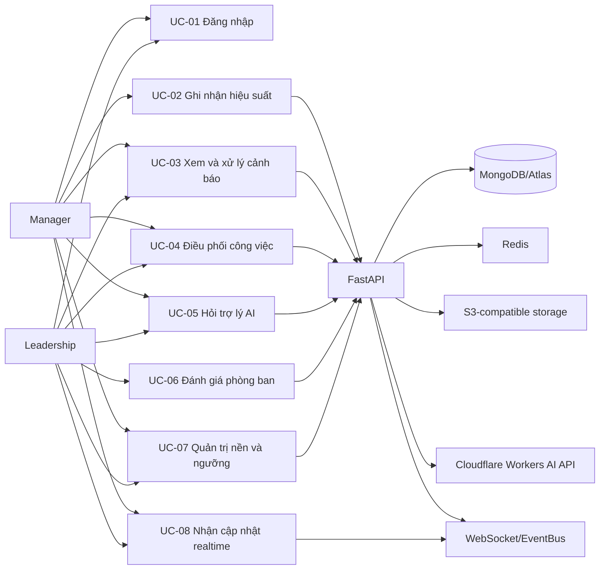

# Use Case Specification và Traceability Matrix

## 1. Use Case Diagram



`Cloudflare AI Worker` trong yêu cầu nghiệp vụ được biểu diễn là system actor mục tiêu. Hiện source chỉ có adapter gọi trực tiếp Cloudflare API; chưa có Worker source/deployment artifact.

## 2. Đặc tả use case

### UC-01 — Đăng nhập

- **Actor:** Manager/Leadership.
- **Pre-condition:** tài khoản tồn tại và `is_active=true`.
- **Happy path:** POST login → repository tìm user → bcrypt verify → phát JWT → đặt HttpOnly access cookie và CSRF cookie → client vào dashboard.
- **Exception:** sai mật khẩu hoặc tài khoản không hoạt động → 401; request tới resource bảo vệ thiếu/sai token hoặc token hết hạn → 401.
- **Post-condition:** request sau dùng cookie-first; Bearer chỉ là compatibility path nếu bật.
- **Endpoint/collections:** `/api/v1/auth/login`, `/api/v1/auth/me`, `/api/v1/auth/logout` → `users`.

### UC-02 — Ghi nhận hiệu suất hàng ngày

- **Actor:** Manager.
- **Pre-condition:** employee thuộc department scope; task review/evidence hợp lệ.
- **Happy path:** lấy daily review → Manager xác nhận task/evidence và quality → service cập nhật execution report → tính/upsert `performance_metrics` → phát `PERFORMANCE_METRIC_CREATED` → detector alert/overload xử lý bất đồng bộ.
- **Exception:** employee ngoài scope → 403/404; thiếu evidence hoặc missing reason → 422; retry cùng mutation có `Idempotency-Key` → replay an toàn.
- **Post-condition:** metric/audit có timestamp; event PERFORMANCE_METRIC_CREATED hiện chỉ mang employee_id; UI có thể nhận refresh qua realtime sau Change Stream.
- **Endpoint/collections:** GET/POST `/api/v1/performance/daily-review` (compatibility endpoint còn được đăng ký), GET/PATCH `/api/v1/performance/daily-reviews/{employee_id}/{date}` → `tasks`, `task_execution_reports`, `performance_metrics`, `audit_logs`.

### UC-03 — Xử lý cảnh báo

- **Actor:** Manager/Leadership.
- **Pre-condition:** user có scope tới alert; alert tồn tại.
- **Happy path:** list/scan → service lọc scope và threshold → tạo alert nếu chưa có fingerprint → user xem suggested action → PATCH resolve → Change Stream broadcast.
- **Exception:** alert ngoài scope → 403/404; alert đã resolved → service trả trạng thái hiện tại và không ghi đè; scan/DB exception đi qua HTTP error contract chung. Flow scan cảnh báo không gọi AI provider và chưa thấy local retry/fallback riêng.
- **Endpoint/collections:** GET `/api/v1/alerts`, POST `/api/v1/alert-scans`, PATCH `/api/v1/alerts/{alert_id}`; `/api/v1/alerts/{alert_id}/resolve` chỉ là alias deprecated → `alerts`, `threshold_configs`, `performance_metrics`, `employees`. Chưa thấy service/repository của flow cảnh báo ghi `audit_logs`.

### UC-04 — Điều phối công việc

- **Actor:** Manager (áp dụng trong phòng); Leadership (phát hành/chấp nhận chỉ thị).
- **Pre-condition:** alert/task/directive hợp lệ, candidate cùng phạm vi và còn active.
- **Happy path:** đọc candidates → hiển thị đề xuất → user xác nhận → ghi coordination plan/audit → resolve alert hoặc fulfill directive → Change Stream refresh; COORDINATION_APPLIED chỉ là internal signal, hiện không có subscriber client riêng.
- **Exception:** AI proposal timeout/provider error → service trả fallback hoặc lỗi thân thiện; user vẫn có thể dùng candidate dữ liệu. Hai request cùng áp dụng một alert → transaction/unique `alert_id` trả 409; flow áp dụng plan này không có version field hoặc Idempotency-Key dependency riêng. Candidate ngoài scope hoặc vượt sức chứa → từ chối.
- **Endpoint/collections:** GET `/api/v1/coordination/suggestions`, POST `/api/v1/coordination/alerts/{alert_id}/plans`, các resource chỉ thị `/api/v1/coordination/department-directives/*` và `/api/v1/coordination/directives/*`, POST `/api/v1/coordination/directives/{directive_id}/fulfillments`, POST `/api/v1/alerts/{alert_id}/ai-proposal`, POST `/api/v1/tasks/{task_id}/ai-proposal` → `alerts`, `tasks`, `performance_metrics`, `employees`, `departments`, `coordination_plans`, `coordination_directives`, `department_alert_directives`, `audit_logs`, `ai_audit_logs`.

### UC-05 — Hỏi trợ lý AI

- **Actor:** Manager/Leadership; AI provider là system actor.
- **Pre-condition:** user đăng nhập; context được giới hạn theo department scope.
- **Happy path:** POST message → server xác thực và xác định scope → đọc conversation/tool context nếu có → tool đọc dữ liệu được scope server-side khi câu hỏi cần dữ liệu → dịch context sang tiếng Việt → factory gọi provider stream với retry/fallback → SSE trả token → audit ghi summary/hash; conversation chỉ lưu bounded tool context khi có `conversation_id`, còn cache áp dụng cho summary/proposal theo service.
- **Exception flows:**
  - Provider/API timeout/transport error/HTTP 429/5xx → retry theo policy; fallback provider nếu cấu hình; cuối cùng trả thông báo tiếng Việt, không lộ exception kỹ thuật.
  - stream rỗng hoặc reasoning bị cắt → coi là lỗi provider, không lưu câu trả lời rỗng.
  - user hỏi ngoài scope → từ chối hoặc chỉ trả dữ liệu được phép.
- **Endpoint/collections:** POST `/api/v1/ai/chat/stream`, POST `/api/v1/ai/leadership-proposal`, POST `/api/v1/ai/tool-preview` → `ai_conversations`, `ai_audit_logs`, `ai_knowledge_chunks` và các collection nghiệp vụ chỉ đọc.

### UC-06 — Đánh giá phòng ban theo tuần

- **Actor:** Leadership.
- **Pre-condition:** department/week hợp lệ; evidence cutoff xác định.
- **Happy path:** service tổng hợp metrics/tasks/alerts/directives → Leadership nhập điểm/ghi chú và attachment → lưu snapshot → audit → Change Stream.
- **Exception:** thiếu dữ liệu → response nêu rõ thiếu dữ liệu; attachment không hợp lệ/quét malware thất bại → không commit session.
- **Endpoint/collections:** GET `/api/v1/department-evaluations/weekly-reviews/{department_id}/{week_start}`, GET `/api/v1/department-evaluations`, POST `/api/v1/department-evaluations/weekly-evaluations`, PATCH `/api/v1/department-evaluations/{evaluation_id}` → `department_weekly_evaluations`, `departments`, `users`, `performance_metrics`, `tasks`, `alerts`, `department_alert_directives`, `department_task_directives`, `attachment_upload_sessions`, `audit_logs`.

### UC-07 — Quản trị dữ liệu nền và ngưỡng

- **Actor:** Leadership quản trị phòng ban và duyệt ngưỡng; Manager/Leadership quản lý nhân viên trong phạm vi được cấp; Manager đề xuất cấu hình ngưỡng cho phòng mình.
- **Pre-condition:** user đã xác thực; scope phòng ban được resolve ở backend. Các thao tác phòng ban và duyệt ngưỡng yêu cầu Leadership; thao tác nhân viên/đề xuất ngưỡng phải khớp `department_id` với scope của Manager.
- **Happy path:** đọc danh sách/chi tiết phòng ban, nhân viên hoặc cấu hình ngưỡng → service/repository áp dụng scope → Leadership tạo/cập nhật/xóa phòng ban hoặc duyệt ngưỡng → Manager/Leadership tạo/cập nhật nhân viên trong scope hoặc Manager đề xuất ngưỡng → response trả resource v1.
- **Exception:** mã ObjectId không hợp lệ → 422; resource không tồn tại hoặc ngoài scope → 404/403; mã phòng ban hoặc mã nhân viên trùng → 409; xóa phòng ban đang có nhân viên → 409; Leadership không được đề xuất ngưỡng và Manager không được duyệt ngưỡng → 403.
- **Endpoint/collections:** GET/POST `/api/v1/departments`, GET/PATCH/DELETE `/api/v1/departments/{department_id}`; GET/POST `/api/v1/employees`, GET/PATCH/DELETE `/api/v1/employees/{employee_id}`; GET/POST `/api/v1/threshold-configs`, PATCH `/api/v1/threshold-configs/{config_id}` hoặc POST `/api/v1/threshold-configs/{config_id}/approvals` → `departments`, `employees`, `threshold_configs`, `users` (qua auth dependency); không thấy service/repository của flow này ghi `audit_logs`.

### UC-08 — Nhận cập nhật realtime

- **Actor:** Manager/Leadership; MongoDB Change Streams và EventBus là system actors/hạ tầng hỗ trợ.
- **Pre-condition:** client có access cookie hoặc query token compatibility được bật; handshake vượt rate limit; user được server resolve và có scope hợp lệ.
- **Happy path:** client mở WebSocket `/ws/realtime` → server ưu tiên cookie, kiểm tra query token compatibility nếu có, gọi lại `resolve_current_user` → `ConnectionManager` đăng ký kết nối theo user/scope → Change Stream worker đọc thay đổi từ collection → EventBus publish topic → WebSocket gửi event phù hợp cho Manager theo phòng hoặc Leadership toàn công ty.
- **Exception:** thiếu token, token không hợp lệ hoặc cookie/query token không khớp → đóng mã 1008; vượt rate limit handshake hoặc limiter lỗi → đóng mã 1013; MongoDB Change Stream gặp `PyMongoError` → ghi log, chờ retry, không làm dừng API; client ngắt kết nối → `ConnectionManager` cleanup.
- **Endpoint/collections:** WebSocket `/ws/realtime` → Change Streams trên `alerts`, `performance_metrics`, `tasks`, `department_alert_directives`, `department_task_directives`, `task_execution_reports`, `department_weekly_evaluations`; EventBus/ConnectionManager không phải collection MongoDB.

## 2b. Đặc tả chi tiết theo cấu trúc fully dressed

Phần này chuẩn hóa UC-01 đến UC-08 theo cùng một biểu mẫu: định danh/phạm vi, điều kiện, Basic Flow, Alternative Flow, Exception Flow, business rule, yêu cầu đặc biệt, liên kết và bằng chứng. Các claim được phân biệt giữa source code và test đã chạy; không suy diễn từ tên endpoint hoặc từ sơ đồ.

### UC-01 — Đăng nhập

#### 2b.1 Định danh & phạm vi

| Trường | Nội dung |
|---|---|
| Mã / tên | UC-01 / Đăng nhập |
| Tác nhân chính | Manager, Leadership; đây là hai giá trị UserRole hiện có |
| Tác nhân phụ | UserRepository, bcrypt, JWT security và cookie/CSRF middleware |
| Mức độ | User goal |
| Mô tả | Người dùng xác thực username/password để tạo phiên làm việc và truy cập các use case cần đăng nhập |

#### 2b.2 Điều kiện

| Trường | Nội dung |
|---|---|
| Pre-condition | User tồn tại trong users, đang active và có password_hash hợp lệ |
| Trigger | Actor gửi POST /api/v1/auth/login với LoginRequest |
| Success Guarantee | Service trả TokenResponse; router đặt access cookie HttpOnly và CSRF cookie; JWT chứa subject, role và department scope |
| Minimal Guarantee | Không trả password/hash; request có X-Request-ID để truy vết; lỗi xác thực không phân biệt quá chi tiết giữa user không tồn tại, mật khẩu sai và user bị khóa |

#### 2b.3 Basic Flow

| Bước | Hành động Actor | Phản hồi hệ thống |
|---:|---|---|
| 1 | Nhập username và password | — |
| 2 | Gửi form | Router nhận LoginRequest và áp rate-limit group login |
| 3 | — | AuthenticationService trim username và UserRepository tìm user |
| 4 | — | Verify password bằng bcrypt và kiểm tra is_active |
| 5 | — | Tạo JWT theo JWT_EXPIRE_MINUTES, role và department_id |
| 6 | — | Đặt access cookie HttpOnly và CSRF cookie đọc được bởi frontend |
| 7 | Điều hướng vào dashboard | Client dùng cookie cho các request tiếp theo |

#### 2b.4 Alternative Flow

| Mã | Rẽ từ bước | Nội dung |
|---|---:|---|
| A1 | 7 | Nếu LEGACY_BEARER_ENABLED bật, request cũ có thể dùng Bearer; cookie vẫn là nguồn ưu tiên |
| A2 | GET /auth/me | Nếu thiếu CSRF cookie, endpoint me có thể cấp bổ sung CSRF cookie mà không thay access cookie |

#### 2b.5 Exception Flow

| Mã | Điều kiện | Kết quả |
|---|---|---|
| E1 | Sai username/password hoặc user inactive | HTTP 401, code unauthorized, có WWW-Authenticate |
| E2 | Thiếu hoặc sai kiểu username/password | HTTP 422, code validation_error |
| E3 | Vượt login quota | HTTP 429, code rate_limit_exceeded và Retry-After |
| E4 | Resource bảo vệ không có token, token hết hạn/sai chữ ký hoặc claim không khớp DB | HTTP 401, code unauthorized |
| E5 | Cookie và Bearer cùng có nhưng khác token | HTTP 401, code unauthorized |

#### 2b.6 Rule, special requirement và liên kết

- Chỉ manager và leadership là role hợp lệ; role/scope được resolve lại từ DB, không tin claim đơn độc.
- Production yêu cầu JWT_SECRET tối thiểu 32 ký tự, AUTH_COOKIE_SECURE=true khi chạy HTTPS và CSRF double-submit cho mutation có cookie.
- Endpoint/collection: auth login/me/logout → users.
- Use case liên quan: UC-01 là pre-condition của UC-02 đến UC-08.
- Bằng chứng source: backend/app/api/auth.py, backend/app/services/auth_service.py, backend/app/api/dependencies.py, backend/app/core/security.py.
- Test đã chạy: tests/test_auth.py, thuộc focused suite 73 passed và test suite bổ sung 64 passed.

### UC-02 — Ghi nhận hiệu suất hàng ngày

#### 2b.1 Định danh & phạm vi

| Trường | Nội dung |
|---|---|
| Mã / tên | UC-02 / Ghi nhận hiệu suất hàng ngày |
| Tác nhân chính | Manager |
| Tác nhân phụ | TaskRepository, TaskExecutionRepository, PerformanceRepository, EvidenceStorage và EventBus |
| Mức độ | User goal |
| Mô tả | Manager review toàn bộ task của một nhân viên trong ngày, xác nhận bằng chứng/điểm và tạo hoặc cập nhật performance metric |

#### 2b.2 Điều kiện

| Trường | Nội dung |
|---|---|
| Pre-condition | Manager có department scope; employee và các task trong ngày thuộc scope; request có items tương ứng |
| Trigger | GET daily review để xem dữ liệu, sau đó POST tạo review hoặc PATCH thay đổi review |
| Success Guarantee | Task execution reports được review, performance_metrics được upsert/tính điểm, audit_logs được ghi và PERFORMANCE_METRIC_CREATED được publish |
| Minimal Guarantee | Write transaction truyền cùng session qua các repository; lỗi giữa bước không để lại batch write dở dang; scope không bị mở rộng |

#### 2b.3 Basic Flow

| Bước | Hành động Actor | Phản hồi hệ thống |
|---:|---|---|
| 1 | Chọn nhân viên và ngày | GET daily review kiểm tra employee trong scope và trả task/report/evidence hiện tại |
| 2 | Nhập score, note, missing_reason cho từng task | Client gửi DailyPerformanceReviewCreate |
| 3 | — | Service kiểm tra employee, tập task phải đầy đủ và không trùng task_id |
| 4 | Đính kèm evidence hoặc nhập lý do thiếu | Service chấp nhận attachment có sẵn hoặc missing_reason hợp lệ |
| 5 | Gửi POST | Tính quality_score theo trọng số priority và tasks_completed từ task DONE trong ngày |
| 6 | — | Ghi report review, metric, audit trong transaction |
| 7 | — | Publish event PERFORMANCE_METRIC_CREATED và trả DailyPerformanceReviewResponse |

#### 2b.4 Alternative Flow

| Mã | Rẽ từ bước | Nội dung |
|---|---:|---|
| A1 | 5 | POST create có Idempotency-Key tùy chọn; retry cùng body sau khi hoàn tất được replay theo idempotency contract |
| A2 | 2 | PATCH dùng update route để thay đổi review đã có; nếu score đổi phải có change_reason hoặc reason |
| A3 | GET attachment | Backend tạo signed download URL; không trả trực tiếp object storage |

#### 2b.5 Exception Flow

| Mã | Điều kiện | Kết quả |
|---|---|---|
| E1 | employee ngoài scope hoặc Leadership gọi nghiệp vụ nghiệm thu nhân viên | HTTP 403, code forbidden |
| E2 | ObjectId/date/task set không hợp lệ, thiếu task review hoặc thiếu evidence và missing_reason | HTTP 422, code validation_error |
| E3 | Review đã tồn tại khi POST hoặc chưa có review khi PATCH | HTTP 409, code conflict |
| E4 | Score thay đổi nhưng thiếu change reason | HTTP 422, code validation_error |
| E5 | Không tìm thấy attachment hoặc signed storage URL không sẵn sàng | HTTP 404 hoặc 503, code not_found/http_error |
| E6 | Lỗi transaction/repository | Không coi workflow thành công; ghi log và để HTTP boundary chuẩn hóa lỗi |

#### 2b.6 Rule, special requirement và liên kết

- Quality score được tính từ các task review theo priority weights low=1.0, medium=1.25, high=1.5; performance_score dùng PerformanceScoreCalculator.
- POST daily review có idempotency dependency; PATCH daily review hiện không khai báo dependency đó.
- Event sau khi commit chỉ mang employee_id; timestamp nằm trong metric/audit, không được mô tả event như có timestamp nếu source chưa thêm field.
- Endpoint/collection: daily review routes → tasks, task_execution_reports, performance_metrics, audit_logs; Change Stream sau đó có thể phát topic performance_metrics.
- Bằng chứng source: backend/app/api/v1/performance.py, backend/app/services/performance_review_service.py, backend/app/events/event_bus.py.
- Test đã chạy: tests/test_performance_review_service.py và tests/test_realtime.py; thuộc focused suite 73 passed.

### UC-03 — Xem và xử lý cảnh báo

#### 2b.1 Định danh & phạm vi

| Trường | Nội dung |
|---|---|
| Mã / tên | UC-03 / Xem và xử lý cảnh báo |
| Tác nhân chính | Manager, Leadership |
| Tác nhân phụ | EarlyWarningService, EarlyWarningDetector, ThresholdConfigRepository, AlertRepository và Change Stream worker |
| Mức độ | User goal |
| Mô tả | Người dùng xem cảnh báo trong scope, chạy scan rule-based và đánh dấu cảnh báo đã xử lý |

#### 2b.2 Điều kiện

| Trường | Nội dung |
|---|---|
| Pre-condition | User đã xác thực; scope được resolve server-side; approved threshold và dữ liệu hiệu suất có thể được đọc |
| Trigger | Mở danh sách, yêu cầu scan hoặc gửi PATCH alert |
| Success Guarantee | Danh sách phản ánh scope/filter; scan tạo cảnh báo theo fingerprint; resolve cập nhật status/resolution note; thay đổi DB có thể đi qua Change Stream |
| Minimal Guarantee | Manager không xử lý alert phòng khác; duplicate fingerprint không tạo bản ghi mới; alert đã resolved không bị ghi đè |

#### 2b.3 Basic Flow

| Bước | Hành động Actor | Phản hồi hệ thống |
|---:|---|---|
| 1 | Mở danh sách cảnh báo | GET /api/v1/alerts trả PageResponse theo scope/filter |
| 2 | Nếu cần, yêu cầu scan | POST /api/v1/alert-scans lấy employee trong scope và chạy detector |
| 3 | — | Approved threshold được đọc; alert mới dùng fingerprint để chống trùng |
| 4 | Xem suggested_action | Response trả severity, message, detected_dates và gợi ý |
| 5 | Gửi status resolved và resolution_note | PATCH alert kiểm tra scope và cập nhật nếu alert còn open |
| 6 | — | Change Stream alerts có thể phát realtime update đến client đúng scope |

#### 2b.4 Alternative Flow

| Mã | Rẽ từ bước | Nội dung |
|---|---:|---|
| A1 | 5 | Nếu alert đã resolved, service trả trạng thái hiện tại với response thành công, không ghi đè |
| A2 | 2 | Scan có thể được kích hoạt bất đồng bộ sau PERFORMANCE_METRIC_CREATED bởi event handler |
| A3 | 1 | Leadership dùng scope toàn công ty; Manager bị giới hạn theo department |

#### 2b.5 Exception Flow

| Mã | Điều kiện | Kết quả |
|---|---|---|
| E1 | Thiếu/sai token hoặc sai scope | HTTP 401/403, code unauthorized/forbidden |
| E2 | alert_id/department_id/date không hợp lệ | HTTP 422, code validation_error |
| E3 | Alert không tồn tại | HTTP 404, code not_found |
| E4 | Rate limit read/mutation/scan bị vượt | HTTP 429, code rate_limit_exceeded |
| E5 | Mongo lỗi trong event scan | Handler ghi log và không làm sập luồng metric ingestion; đây là nhánh retry/operational cần theo dõi |

#### 2b.6 Rule, special requirement và liên kết

- Alert early-warning đọc approved threshold; overload alert được tạo từ overload event ở handler khác.
- Alert scan hiện không gọi AI provider; AI proposal của alert là luồng advisory riêng ở UC-04/UC-05.
- Resolve alert hiện không tự ghi audit entry trong EarlyWarningService; không mô tả audit_logs là side-effect đã chứng minh của PATCH này.
- Endpoint/collection: alerts list/scan/resolve → alerts, threshold_configs, performance_metrics, employees.
- Bằng chứng source: backend/app/api/v1/alerts.py, backend/app/services/alert_service.py, backend/app/services/early_warning_detector.py.
- Test đã chạy: tests/test_alert_service.py, tests/test_alerts_v1.py, thuộc focused suite 73 passed.

### UC-04 — Điều phối công việc

#### 2b.1 Định danh & phạm vi

| Trường | Nội dung |
|---|---|
| Mã / tên | UC-04 / Điều phối công việc |
| Tác nhân chính | Manager áp dụng kế hoạch trong phòng; Leadership phát hành/chấp nhận directive |
| Tác nhân phụ | CoordinationService, TaskService, AlertRepository, CoordinationRepository, EventBus và AI proposal service |
| Mức độ | User goal |
| Mô tả | Người dùng chọn phương án phân bổ lại công việc hoặc thực hiện vòng đời directive đã được backend kiểm tra scope |

#### 2b.2 Điều kiện

| Trường | Nội dung |
|---|---|
| Pre-condition | Alert/task/directive tồn tại; candidate còn active, cùng phạm vi và còn capacity |
| Trigger | Actor xem suggestions/candidates hoặc gửi apply/fulfillment/directive action |
| Success Guarantee | Kế hoạch hoặc directive state được ghi theo workflow; với apply alert, alert được resolve cùng transaction |
| Minimal Guarantee | Không áp dụng candidate ngoài scope; lỗi giữa transaction không để lại plan/audit/resolve dở dang; AI chỉ đề xuất |

#### 2b.3 Basic Flow

| Bước | Hành động Actor | Phản hồi hệ thống |
|---:|---|---|
| 1 | Mở suggestions hoặc candidates | Service đọc alert/task và tính candidate theo scope |
| 2 | Chọn candidate/số task | Backend kiểm tra capacity an toàn, cùng phòng ban và status |
| 3 | Gửi apply plan | CoordinationService tạo coordination plan và audit trong transaction |
| 4 | — | Alert được resolve; publish COORDINATION_APPLIED là internal signal |
| 5 | Leadership phát directive hoặc Manager fulfill | Backend chuyển state và ghi dữ liệu tương ứng |
| 6 | — | Client nhận thay đổi alert/directive qua Change Stream khi collection tương ứng thay đổi |

#### 2b.4 Alternative Flow

| Mã | Rẽ từ bước | Nội dung |
|---|---:|---|
| A1 | 2 | Không chỉ định candidate/số task thì service chọn candidate và số task mặc định trong capacity |
| A2 | 1 | AI proposal đọc candidates đã được backend rank/filter; user tự quyết định apply |
| A3 | 5 | Provider AI lỗi/timeout thì trả fallback/friendly response; dữ liệu candidate vẫn có thể dùng độc lập |

#### 2b.5 Exception Flow

| Mã | Điều kiện | Kết quả |
|---|---|---|
| E1 | Manager thao tác ngoài department hoặc Leadership gọi employee coordination apply | HTTP 403, code forbidden |
| E2 | Candidate không phù hợp, transfer count vượt capacity | HTTP 422, code validation_error |
| E3 | Alert đã có plan/directive hoặc directive action trùng | HTTP 409, code conflict |
| E4 | Transaction/repository không commit | HTTP 503, code http_error; plan/audit/alert phải giữ trạng thái trước thao tác |
| E5 | AI provider lỗi | Không tự động mutation; trả fallback hoặc friendly response theo AI service |

#### 2b.6 Rule, special requirement và liên kết

- Apply employee coordination chỉ dành cho Manager có scope; test source xác nhận Leadership không được apply luồng này.
- COORDINATION_APPLIED là internal observability signal; source hiện không có subscriber runtime riêng, nên không mô tả nó như client event trực tiếp.
- Endpoint/collection: coordination suggestions/plans/directives/fulfillments và task/alert AI proposal → alerts, tasks, performance_metrics, employees, departments, coordination_plans, coordination_directives, department directives, audit logs và AI audit logs tùy flow.
- Bằng chứng source: backend/app/services/coordination_service.py, backend/app/api/v1/coordination.py, backend/app/api/v1/tasks.py, backend/app/api/v1/alerts.py.
- Test đã chạy: tests/test_coordination_service.py, thuộc focused suite 73 passed.

### UC-05 — Hỏi trợ lý AI

#### 2b.1 Định danh & phạm vi

| Trường | Nội dung |
|---|---|
| Mã / tên | UC-05 / Hỏi trợ lý AI |
| Tác nhân chính | Manager, Leadership |
| Tác nhân phụ | AiService, AiChatOrchestrator, AiToolService, provider factory, Cloudflare API trực tiếp, Mongo repositories và audit logger |
| Mức độ | User goal |
| Mô tả | User hỏi dữ liệu hoặc câu hỏi chung; backend giữ scope, dịch nhãn/sanitize context và stream câu trả lời tiếng Việt |

#### 2b.2 Điều kiện

| Trường | Nội dung |
|---|---|
| Pre-condition | User đã xác thực; scope được resolve; provider/config phù hợp hoặc casual chat fallback có thể hoạt động |
| Trigger | POST /api/v1/ai/chat/stream, tool-preview hoặc leadership-proposal |
| Success Guarantee | Chat trả SSE lifecycle; tool chỉ đọc dữ liệu được scope; leadership proposal trả bản nháp reviewable, không tự phát hành directive |
| Minimal Guarantee | Không để AI thực thi mutation; không đưa field kỹ thuật thô ra user; provider/database lỗi không làm sập API nghiệp vụ ngoài stream |

#### 2b.3 Basic Flow

| Bước | Hành động Actor | Phản hồi hệ thống |
|---:|---|---|
| 1 | Gửi message/mode/conversation_id | API xác thực, áp rate limit ai_chat và tạo conversation id nếu cần |
| 2 | — | Xác định câu hỏi cần data tool/follow-up và đọc context theo user/scope |
| 3 | — | Tool đọc dữ liệu được phép; context được giới hạn và sanitize nhãn |
| 4 | — | AiService/factory gọi provider trực tiếp với timeout/retry/fallback policy |
| 5 | Chờ câu trả lời | SSE gửi start, conversation, status khi cần, token từng phần và done |
| 6 | — | Audit summary/hash và bounded conversation context được lưu khi điều kiện cho phép |

#### 2b.4 Alternative Flow

| Mã | Rẽ từ bước | Nội dung |
|---|---:|---|
| A1 | 2 | Casual chat không cần tool vẫn stream được nếu Mongo-backed tool service unavailable |
| A2 | 4 | Provider chính lỗi thì factory thử fallback nếu được cấu hình; nếu không, stream friendly error |
| A3 | 1 | POST leadership-proposal chỉ cho Leadership và trả draft để người dùng review; không có side-effect phát directive |

#### 2b.5 Exception Flow

| Mã | Điều kiện | Kết quả |
|---|---|---|
| E1 | Thiếu token/sai scope hoặc Manager gọi leadership proposal | HTTP 401/403, code unauthorized/forbidden |
| E2 | Vượt AI quota | HTTP 429 ở boundary rate limit hoặc SSE error/friendly response ở provider stream |
| E3 | Provider timeout, transport error, stream rỗng hoặc reasoning bị cắt | SSE type=error với thông báo thân thiện rồi type=done; không lưu câu trả lời rỗng |
| E4 | Tool query ngoài scope/unknown candidate | Tool từ chối hoặc chỉ trả dữ liệu đã được backend lọc |

#### 2b.6 Rule, special requirement và liên kết

- Cloudflare hiện là API provider được gọi trực tiếp; không mô tả custom Cloudflare Worker là artefact hiện hành.
- AI action proposal là advisory-only; apply/fulfill phải đi qua UC-04 và endpoint mutation riêng.
- SSE event types đã xác nhận ở source: start, conversation, status, token, error, done.
- Endpoint/collection: chat/stream, tool-preview, leadership-proposal → scope-bound domain collections, ai_conversations, ai_audit_logs, ai_knowledge_chunks.
- Bằng chứng source: backend/app/api/ai.py, backend/app/services/ai_service.py, backend/app/ai/factory.py, backend/app/core/field_labels_vi.py.
- Test đã chạy: tests/test_ai_api.py, tests/test_ai_service.py, thuộc focused suite 73 passed.

### UC-06 — Đánh giá phòng ban theo tuần

#### 2b.1 Định danh & phạm vi

| Trường | Nội dung |
|---|---|
| Mã / tên | UC-06 / Đánh giá phòng ban theo tuần |
| Tác nhân chính | Leadership |
| Tác nhân phụ | DepartmentEvaluationService, DepartmentEvaluationRepository, EvidenceStorage, MalwareScanner, AttachmentUploadService và Change Stream |
| Mức độ | User goal |
| Mô tả | Leadership xem evidence snapshot, nhập điểm đánh giá tuần và attachment, sau đó lưu bản đánh giá có audit |

#### 2b.2 Điều kiện

| Trường | Nội dung |
|---|---|
| Pre-condition | Leadership đã xác thực; department tồn tại; tuần không ở tương lai; cutoff tuần đã xác định |
| Trigger | GET weekly review/list/detail hoặc POST/PATCH evaluation |
| Success Guarantee | Evidence snapshot được tạo; overall_score tính theo 0.4 directive execution + 0.4 stability + 0.2 timeliness; evaluation, attachment metadata và audit được lưu |
| Minimal Guarantee | Attachment lỗi bị discard/delete; duplicate evaluation không tạo bản ghi thứ hai; dữ liệu evidence được snapshot theo cutoff |

#### 2b.3 Basic Flow

| Bước | Hành động Actor | Phản hồi hệ thống |
|---:|---|---|
| 1 | Chọn department/week | GET weekly review chuẩn hóa ngày về Monday và trả evidence/can_evaluate |
| 2 | Nhập ba điểm và note, chọn file hoặc upload session | API parse payload và kiểm tra hình thức upload |
| 3 | Gửi POST weekly-evaluations | Service kiểm tra cutoff, duplicate và build snapshot từ metrics/tasks/alerts/directives |
| 4 | — | Validate MIME/extension, checksum và malware scan nếu có file |
| 5 | — | Insert evaluation, commit upload session nếu dùng direct upload và ghi audit |
| 6 | — | Trả DepartmentWeeklyEvaluationResponse; Change Stream có thể cập nhật client |

#### 2b.4 Alternative Flow

| Mã | Rẽ từ bước | Nội dung |
|---|---:|---|
| A1 | 2 | Dùng attachment_session_ids thay vì multipart files; không được gửi đồng thời cả hai |
| A2 | 1 | GET list v1 nhận offset/limit, trả body list envelope và thêm header pagination |
| A3 | 2 | PATCH thay thế điểm/attachment của evaluation đã có; attachment cũ được xử lý theo service flow |

#### 2b.5 Exception Flow

| Mã | Điều kiện | Kết quả |
|---|---|---|
| E1 | Sai role, department không tồn tại hoặc evaluation ngoài scope | HTTP 403/404, code forbidden/not_found |
| E2 | Tuần tương lai hoặc payload/file không hợp lệ | HTTP 422, code validation_error |
| E3 | Chưa qua cutoff hoặc evaluation đã tồn tại | HTTP 409, code conflict |
| E4 | Upload service/storage/scanner chưa sẵn sàng | HTTP 503, code http_error; file/session phải được discard hoặc cleanup |
| E5 | Evaluation không tồn tại khi PATCH/detail | HTTP 404, code not_found |

#### 2b.6 Rule, special requirement và liên kết

- Week start được normalize về Monday; cutoff dùng WEEKLY_EVALUATION_CUTOFF_HOUR theo business timezone.
- POST weekly evaluation có idempotency dependency; PATCH hiện không có dependency idempotency riêng.
- Endpoint/collection: weekly review/list/detail/create/update → department_weekly_evaluations, departments, users, performance_metrics, tasks, alerts, department directives, attachment_upload_sessions, audit_logs.
- Bằng chứng source: backend/app/api/department_evaluations.py, backend/app/api/v1/department_evaluations.py, backend/app/services/department_evaluation_service.py.
- Test đã chạy: tests/test_department_evaluation_service.py, thuộc focused suite 73 passed.

### UC-07 — Quản trị dữ liệu nền và ngưỡng

#### 2b.1 Định danh & phạm vi

| Trường | Nội dung |
|---|---|
| Mã / tên | UC-07 / Quản trị dữ liệu nền và ngưỡng |
| Tác nhân chính | Leadership cho departments/threshold approval; Manager hoặc Leadership cho employee theo scope; Manager đề xuất threshold |
| Tác nhân phụ | DepartmentService, EmployeeService, ThresholdConfigService, repositories và RBAC dependencies |
| Mức độ | User goal |
| Mô tả | Người dùng quản lý phòng ban, nhân viên và vòng đời cấu hình ngưỡng theo quyền backend |

#### 2b.2 Điều kiện

| Trường | Nội dung |
|---|---|
| Pre-condition | User xác thực; current_user/department scope được server resolve; resource payload hợp lệ |
| Trigger | GET/POST/PATCH/DELETE resource hoặc POST approval |
| Success Guarantee | Resource được trả theo response model v1; mutation chỉ thành công khi role/scope và business constraint hợp lệ |
| Minimal Guarantee | Không tin department_id từ client để mở scope; conflict không làm mất resource; unauthorized action bị chặn backend |

#### 2b.3 Basic Flow

| Bước | Hành động Actor | Phản hồi hệ thống |
|---:|---|---|
| 1 | Mở danh sách/chi tiết | Backend resolve role/scope và trả PageResponse hoặc resource response |
| 2 | Nhập dữ liệu phòng ban/nhân viên hoặc threshold | Pydantic model kiểm tra field/type/range |
| 3 | Gửi mutation | Service kiểm tra scope, duplicate code và quan hệ resource |
| 4 | Leadership duyệt threshold | POST /threshold-configs/{id}/approvals chuyển trạng thái approved |
| 5 | — | Trả resource v1; frontend refresh theo response |

#### 2b.4 Alternative Flow

| Mã | Rẽ từ bước | Nội dung |
|---|---:|---|
| A1 | 1 | Leadership nhận scope toàn công ty; Manager nhận dữ liệu phòng ban được gán |
| A2 | 2 | Manager POST threshold proposal; Leadership dùng approval endpoint riêng, không dùng cùng quyền |
| A3 | 1 | Các alias legacy được giữ ở v1 compatibility layer; canonical/native route phải theo OpenAPI hiện hành |

#### 2b.5 Exception Flow

| Mã | Điều kiện | Kết quả |
|---|---|---|
| E1 | Thiếu token hoặc sai role | HTTP 401/403, code unauthorized/forbidden |
| E2 | ObjectId/field/range không hợp lệ | HTTP 422, code validation_error |
| E3 | Code trùng, xóa department còn employee hoặc threshold state conflict | HTTP 409, code conflict |
| E4 | Resource không tồn tại hoặc ngoài scope | HTTP 404/403, code not_found/forbidden |

#### 2b.6 Rule, special requirement và liên kết

- Leadership-only: create/update/delete department và approve threshold; Manager không được approve.
- Employee query/mutation dùng department scope; Leadership có thể thao tác toàn công ty theo route.
- Threshold v1 list dùng PageResponse; proposal/approval có route compatibility/native khác nhau, cần giữ catalog đồng bộ với OpenAPI.
- Endpoint/collection: departments, employees, threshold-configs → departments, employees, threshold_configs, users qua auth dependency.
- Bằng chứng source: backend/app/api/v1/departments.py, backend/app/api/v1/employees.py, backend/app/api/v1/thresholds.py, backend/app/api/thresholds.py, backend/app/api/dependencies.py.
- Test đã chạy: tests/test_api_v1_crud.py, tests/test_department_service.py, tests/test_employee_service.py, tests/test_threshold_config.py; thuộc suite bổ sung 64 passed.

### UC-08 — Nhận cập nhật realtime

#### 2b.1 Định danh & phạm vi

| Trường | Nội dung |
|---|---|
| Mã / tên | UC-08 / Nhận cập nhật realtime |
| Tác nhân chính | Manager, Leadership |
| Tác nhân phụ | MongoDB Change Streams, EventBus, ConnectionManager và WebSocket |
| Mức độ | User goal |
| Mô tả | Client duy trì WebSocket và nhận thay đổi thuộc scope mà không reload toàn trang |

#### 2b.2 Điều kiện

| Trường | Nội dung |
|---|---|
| Pre-condition | Cookie hợp lệ hoặc query token compatibility bật; handshake không bị rate limit; current_user resolve thành công |
| Trigger | Client mở /ws/realtime hoặc Mongo worker publish collection change |
| Success Guarantee | ConnectionManager giữ socket theo user/role/department; client nhận topic/operation/data đúng scope |
| Minimal Guarantee | Không gửi event phòng khác cho Manager; disconnect được cleanup; payload không làm lộ ObjectId/datetime dạng không serialize được |

#### 2b.3 Basic Flow

| Bước | Hành động Actor | Phản hồi hệ thống |
|---:|---|---|
| 1 | Mở WebSocket /ws/realtime | Server kiểm tra rate limit websocket_handshake |
| 2 | Gửi cookie/query token | Cookie được ưu tiên; token được resolve lại với UserRepository |
| 3 | — | ConnectionManager accept và lưu role/department |
| 4 | Worker nhận Mongo Change Stream | EventBus broadcast topic tương ứng |
| 5 | — | Leadership nhận toàn công ty; Manager chỉ nhận department match |
| 6 | Giữ socket mở | Server receive_text để duy trì kết nối; disconnect thì cleanup |

#### 2b.4 Alternative Flow

| Mã | Rẽ từ bước | Nội dung |
|---|---:|---|
| A1 | 2 | Query token chỉ là compatibility path khi LEGACY_WS_QUERY_TOKEN_ENABLED=true |
| A2 | 4 | Nếu fullDocument không có, payload dùng documentKey; ObjectId chuyển thành string và datetime thành ISO string |
| A3 | 5 | Directive scope ưu tiên target_department_id theo ConnectionManager |

#### 2b.5 Exception Flow

| Mã | Điều kiện | Kết quả |
|---|---|---|
| E1 | Thiếu/sai token hoặc cookie/query token mismatch | Đóng WebSocket code 1008 |
| E2 | Rate limit hoặc limiter exception | Đóng WebSocket code 1013 |
| E3 | Mongo Change Stream lỗi | Worker log/retry theo worker policy; không coi là client event thành công |
| E4 | Client disconnect hoặc send failure | ConnectionManager remove connection |

#### 2b.6 Rule, special requirement và liên kết

- Topic runtime đã xác nhận: alerts, performance_metrics, tasks, department_directives, task_directives, task_execution_reports, department_evaluations.
- Payload hiện là runtime dict gồm topic, operation, data; chưa có Pydantic/OpenAPI message schema riêng.
- Endpoint/collection: WebSocket /ws/realtime → Change Streams trên các collection nêu ở mục 2.
- Bằng chứng source: backend/app/realtime/websocket.py, backend/app/realtime/connection_manager.py, backend/app/events/event_bus.py.
- Test đã chạy: tests/test_realtime.py, thuộc focused suite 73 passed.

### 2b.7 Tổng hợp bằng chứng test

| Nhóm test | Kết quả |
|---|---|
| Auth, performance review, alerts, coordination, AI, department evaluation, realtime | 73 passed, 1 warning deprecation từ Starlette/httpx |
| API v1 CRUD, task API, department/employee/threshold service, pagination, HTTP contract, rate limit | 64 passed, 1 warning deprecation từ Starlette/httpx |

Các test trên là test tự động trong checkout hiện tại; chúng không thay thế browser evidence, production runtime evidence, load test hoặc xác minh owner/scope trên dữ liệu production thật.

## 3. System Sequence Diagram — AI chat stream

```mermaid
sequenceDiagram
  participant UI as React AI widget
  participant API as FastAPI /api/v1/ai/chat/stream
  participant RBAC as Auth + department scope
  participant DATA as Mongo repositories/RAG
  participant CF as Cloudflare Workers AI API trực tiếp
  participant FB as Fallback provider

  UI->>API: POST message + mode + conversation_id
  API->>RBAC: xác thực cookie/Bearer và scope
  RBAC-->>API: CurrentUser + department scope
  API->>DATA: đọc conversation/tool context theo scope
  alt Câu hỏi cần dữ liệu
    API->>DATA: tool đọc dữ liệu đã scope server-side
  end
  API->>API: dịch context kỹ thuật sang tiếng Việt và sanitize prompt
  API->>CF: gọi trực tiếp + retry/timeout policy
  alt provider success
    CF-->>API: SSE chunks
    API-->>UI: SSE text chunks
  else timeout/HTTP error/empty stream
    API->>FB: fallback nếu được cấu hình
    FB-->>API: SSE chunks hoặc lỗi
    API-->>UI: fallback text / friendly error
  end
  API->>DATA: audit summary/hash; lưu bounded tool context nếu có conversation_id
```

`CF` trong sơ đồ là Cloudflare Workers AI API hiện hành. Custom Worker/`workers.dev` chỉ là target contract được mô tả ở tài liệu khác, chưa có source hoặc deployment artifact trong repo.

## 4. Traceability Matrix

| Use Case | API v1 chính | Collection đọc/ghi chính |
|---|---|---|
| UC-01 | `/auth/login`, `/auth/me`, `/auth/logout` | `users` |
| UC-02 | `GET/POST /performance/daily-review`, `GET/PATCH /performance/daily-reviews/{employee_id}/{date}` | `tasks`, `task_execution_reports`, `performance_metrics`, `audit_logs` |
| UC-03 | `GET /alerts`, `POST /alert-scans`, `PATCH /alerts/{id}`; `/alerts/{id}/resolve` là alias deprecated | `alerts`, `threshold_configs`, `performance_metrics`, `employees` |
| UC-04 | `/coordination/suggestions`, `/coordination/alerts/{id}/plans`, `/coordination/department-directives/*`, `/coordination/directives/*`, `/alerts/{id}/ai-proposal`, `/tasks/{id}/ai-proposal` | `alerts`, `tasks`, `performance_metrics`, `employees`, `departments`, `coordination_plans`, `coordination_directives`, `department_alert_directives`, `audit_logs`, `ai_audit_logs` |
| UC-05 | `/ai/chat/stream`, `/ai/leadership-proposal`, `/ai/tool-preview` | scope-bound nghiệp vụ, `ai_conversations`, `ai_audit_logs`, `ai_knowledge_chunks` |
| UC-06 | `GET /department-evaluations/weekly-reviews/{department_id}/{week_start}`, `GET /department-evaluations`, `POST /department-evaluations/weekly-evaluations`, `PATCH /department-evaluations/{id}` | `department_weekly_evaluations`, `departments`, `users`, `performance_metrics`, `tasks`, `alerts`, `department_alert_directives`, `department_task_directives`, `attachment_upload_sessions`, `audit_logs` |
| UC-07 | `GET/POST /departments`, `GET/PATCH/DELETE /departments/{id}`, `GET/POST /employees`, `GET/PATCH/DELETE /employees/{id}`, `GET/POST /threshold-configs`, `PATCH /threshold-configs/{id}`, `POST /threshold-configs/{id}/approvals` | `departments`, `employees`, `threshold_configs`, `users` |
| UC-08 Realtime | WebSocket `/ws/realtime` | Change Streams trên `alerts`, `performance_metrics`, `tasks`, `department_alert_directives`, `department_task_directives`, `task_execution_reports`, `department_weekly_evaluations` |

## 5. Hướng dẫn bổ sung ảnh minh chứng

Các ảnh sau dùng để chứng minh actor, endpoint, scope, realtime và AI flow. Mỗi ảnh cần ghi môi trường (`local`/`production`), thời điểm và mã evidence. Không chụp password, JWT, cookie value, API token, connection string hoặc dữ liệu nhân sự thật.

| Mã | Ảnh minh chứng nên bổ sung | Mục đích xác nhận |
|---|---|---|
| UC-E01 | FastAPI `/openapi.json` hoặc `/docs` hiển thị các route `/api/v1` của UC-01 đến UC-07 | Đối chiếu method/path thực tế với đặc tả và matrix |
| UC-E02 | DevTools Network của login, `/auth/me`, `/auth/logout`; che cookie/token value | Xác nhận auth flow, cookie và endpoint |
| UC-E03 | Request daily review/alert/coordination/evaluation bằng tài khoản test, kèm status HTTP và `X-Request-ID` | Xác nhận happy path, scope và mã lỗi; không dùng dữ liệu thật |
| UC-E04 | DevTools WebSocket hiển thị `/ws/realtime` và event test đã che dữ liệu | Xác nhận handshake và nhận realtime update |
| UC-E05 | Terminal/log backend hiển thị Change Stream worker, EventBus topic và retry khi test lỗi Mongo nếu có | Xác nhận hạ tầng realtime và nhánh retry |
| UC-E06 | AI chat Network hiển thị `/ai/chat/stream`, `text/event-stream`, các event `data:`; Cloudflare Dashboard usage | Xác nhận SSE và Cloudflare API trực tiếp; không chứng minh custom Worker |
| UC-E07 | MongoDB Compass/Atlas hiển thị collection liên quan sau thao tác test và bản ghi audit đã che ID | Đối chiếu collection đọc/ghi; không thay thế source audit hoặc load test |

### Quy tắc lưu ảnh

- Đặt tên theo mã, ví dụ `UC-E01-openapi-v1.png`, `UC-E04-websocket-realtime.png`, `UC-E06-ai-sse-cloudflare.png`.
- Phân biệt `source/static evidence`, `direct runtime evidence` và `browser/UI evidence`.
- Nếu endpoint chỉ là alias compatibility hoặc Worker target chưa implement, ghi rõ trong chú thích ảnh, không trình bày như endpoint/artefact hiện hành chính.
- Ảnh không thay thế cho kiểm thử failure-path, load test, scope test giữa Manager/Leadership hoặc xác minh runtime production.

## 6. Changelog

| Ngày | Thay đổi | Nguồn/kiểm chứng |
|---|---|---|
| 2026-09-16 | Chuẩn hóa UC-01 đến UC-08 theo cấu trúc fully dressed: định danh, actor phụ, level, pre/trigger/post/minimal guarantee, Basic/Alternative/Exception Flow, mã lỗi, business rule, special requirement, liên kết và bằng chứng. | Đối chiếu router/service/repository/model trong backend/app; chạy focused suite UC chính 73 passed và suite API/RBAC/pagination bổ sung 64 passed, mỗi suite có 1 cảnh báo deprecation từ Starlette/httpx. |
