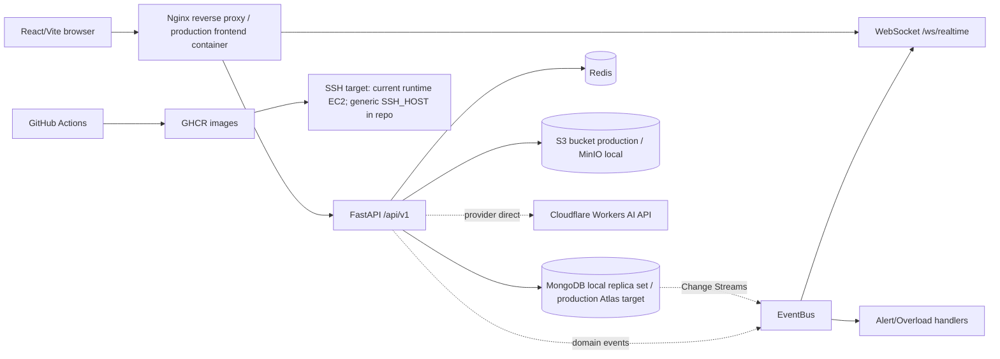

# SAD — System Architecture Document

## 1. Hiện trạng đã xác nhận



Bằng chứng: `README.md`, `docker-compose.yml`, `docker-compose.production.yml`, `frontend/nginx.conf`, `backend/app/main.py`, `backend/app/events/event_bus.py`, `backend/app/realtime/change_stream_worker.py`, `backend/app/realtime/connection_manager.py`, `backend/app/ai/providers.py`, `.github/workflows/cd.yml`.

Trong sơ đồ, nhánh `MongoDB Change Streams → EventBus → WebSocket` thể hiện các topic realtime. Alert/Overload handlers được kích hoạt qua domain events riêng (`PERFORMANCE_METRIC_CREATED` và `OVERLOAD_DETECTED`) do luồng nghiệp vụ hiệu suất/quá tải phát ra; không hiểu sơ đồ là Change Stream gọi trực tiếp detector. Backend production đã được xác nhận trỏ đúng MongoDB Atlas; cluster/user/network values không lưu trong repo.

## 2. Luồng triển khai

- **Local:** Docker Compose chạy MongoDB replica set, Redis và MinIO; backend Uvicorn ở `127.0.0.1:8000`; frontend Vite ở `127.0.0.1:5173`.
- **Production hiện tại:** GHCR giữ backend/frontend image; `cd.yml` SSH tới `SSH_HOST`, chạy `docker compose -f docker-compose.production.yml pull/up`; frontend publish port `${FRONTEND_PORT:-80}`, backend chỉ `expose: 8000`; health check chuẩn chạy nội bộ `http://127.0.0.1/api/v1/health`. Alias `http://127.0.0.1/api/health` vẫn tồn tại để tương thích. AWS, S3 bucket, Redis production configuration, MongoDB Atlas target và CI/CD success đã được xác nhận theo evidence runtime của chủ dự án. Giá trị URI/cluster/user/network cụ thể không lưu trong repo.
- **AWS:** workflow không hard-code AWS service/account/region và không dùng ECR, Kubernetes hoặc CloudWatch action. `SSH_HOST` là secret generic trong repo; runtime hiện tại đã được xác nhận thủ công là EC2. AWS account/region/Elastic IP/security group/CloudWatch vẫn chưa được lưu trong repo.

## 3. API routing và compatibility

- Contract chuẩn: `/api/v1/*`.
- Compatibility: `/api/*` vẫn tồn tại trong giai đoạn chuyển đổi; middleware ghi nhận legacy usage và deprecation.
- Health endpoint được đăng ký ở cả `/api/v1/health` và alias `/api/health`; production Docker healthcheck và CD verification dùng route chuẩn `/api/v1/health`.
- OpenAPI: FastAPI hiện đăng ký mặc định `/openapi.json`, `/docs`, `/redoc`; chưa thấy điều kiện trong `main.py`/settings để tắt các route này theo môi trường.
- Frontend production hiện gọi same-origin `/api/v1/*`; `VITE_DEV_API_ORIGIN` chỉ phục vụ Vite dev proxy. Chưa có `VITE_API_BASE_URL` trong `.env.example`.

## 4. Auth, CORS và cookie

- Access token được đặt trong HttpOnly cookie; CSRF token là cookie đọc được để client gửi double-submit.
- Legacy Bearer và WebSocket query token tồn tại nhưng có cờ tắt riêng.
- `CORS_ORIGINS` là danh sách origin cụ thể; `allow_credentials=True`; wildcard bị validator từ chối.
- Khi có domain, cập nhật đồng thời `CORS_ORIGINS`, `AUTH_COOKIE_DOMAIN` nếu cần, `STORAGE_PUBLIC_CORS_ORIGINS`, `STORAGE_PUBLIC_ENDPOINT_URL`, GitHub Environment variable `APP_URL`, DNS/TLS và cấu hình reverse proxy. `VITE_DEV_API_ORIGIN` chỉ dành cho Vite dev proxy; production hiện same-origin và chưa có `VITE_API_BASE_URL`. Nếu dùng OpenRouter ở production, rà soát cả `HTTP-Referer` provider. Không dùng IP/public host cũ làm giá trị production sau cutover.

## 5. Realtime và fault isolation

1. Các Mongo Change Stream worker theo dõi `alerts`, `performance_metrics`, `tasks`, directives, execution reports và department evaluations.
2. Worker publish topic thay đổi nội bộ vào `EventBus`; `ConnectionManager` đăng ký các topic này để broadcast WebSocket.
3. Luồng nghiệp vụ hiệu suất/quá tải publish domain events riêng; metric/overload/alert handlers được subscribe độc lập với WebSocket.
4. WebSocket xác thực user, áp rate limit tại handshake và gửi đúng phạm vi department/role.
5. `EventBus.publish()` chạy các handler bằng `asyncio.gather(..., return_exceptions=True)` và ghi log lỗi từng handler; Change Stream worker retry khi gặp `PyMongoError`.

MongoDB production phải là replica set/Atlas để Change Streams hoạt động. Local compose đã cấu hình replica set `rs0`.

## 6. AI integration boundary

Hiện tại `CloudflareProvider`, `CloudflareToolProvider` và `CloudflareEmbeddingProvider` gọi trực tiếp Cloudflare API bằng bearer API token. Đây **không phải** một Cloudflare Worker subdomain. Phần dưới đây là kiến trúc mục tiêu nếu sau này tách thêm custom Worker, chưa phải hiện trạng:

- FastAPI chỉ gọi `AI_WORKER_BASE_URL` qua HTTPS.
- Worker giữ provider/model binding và gọi Cloudflare Workers AI.
- FastAPI gửi header secret riêng, không gửi Cloudflare account token xuống client.
- Worker trả JSON hoặc SSE theo contract mục tiêu tại [05 — API & AI Worker Contract](05-api-and-worker-contract.md), dùng `AI_WORKER_BASE_URL`, header `X-WorkMind-Worker-Token` và secret `AI_WORKER_SHARED_SECRET`. File contract có phân biệt rõ contract Cloudflare direct hiện hành và contract Worker mục tiêu; repo chưa có Worker artifact để thực thi phần mục tiêu này.

## 7. Quyết định hạ tầng cần chốt

| Hạng mục | Hiện trạng | Giá trị cần điền |
|---|---|---|
| AWS account/region | AWS đã được cấu hình cho môi trường production; account/region không có trong source | `<AWS_ACCOUNT_ID>`, `<AWS_REGION>` |
| Compute | SSH target runtime đã được xác nhận là EC2; instance ID/hostname cụ thể không có trong source | `<EC2_INSTANCE_ID>`, `<ELASTIC_IP_OR_HOSTNAME>` |
| Reverse proxy/TLS | Nginx image có; domain chưa cấu hình | `<PUBLIC_HTTPS_ORIGIN>` |
| MongoDB | Backend production đã được xác nhận trỏ MongoDB Atlas; cluster/database user cụ thể không có trong source | `<ATLAS_CLUSTER>`, `<DATABASE_USER>` |
| S3 bucket | S3 bucket AWS production đã được cấu hình; tên bucket/region cụ thể không có trong source | `<S3_BUCKET>`, `<S3_REGION>` |
| Redis | `.env.production` đã xác nhận `RATE_LIMIT_BACKEND=redis`; URI/cloud service cụ thể không có trong source | `<REDIS_TLS_URL>` |
| AI Worker | Không sử dụng custom AI Worker trong kiến trúc hiện tại; FastAPI gọi trực tiếp Cloudflare Workers AI API | Không áp dụng hiện tại; chỉ điền `<WORKER_URL>` nếu sau này tách custom Worker |
| Observability | README nêu Docker log/health; CloudWatch chưa cấu hình | `<LOG_GROUP>`, `<RETENTION_DAYS>` nếu triển khai CloudWatch sau này |

## 8. Hướng dẫn bổ sung ảnh minh chứng

Các ảnh dưới đây dùng để chứng minh kiến trúc và triển khai thực tế. Chỉ chụp thông tin cần thiết; phải che API token, secret key, mật khẩu, JWT, private key và credential trong `MONGO_URI`/`REDIS_URL`.

| Mã | Phần kiến trúc | Ảnh minh chứng nên bổ sung | Mục đích xác nhận | Trạng thái |
|---|---|---|---|---|
| ARCH-01 | Mục 1 — Sơ đồ kiến trúc | Sơ đồ hoặc ảnh production gồm frontend/Nginx, FastAPI, MongoDB Atlas, Redis, S3 và Cloudflare Workers AI | Xác nhận các node và boundary triển khai thực tế | Cần bổ sung ảnh topology; sơ đồ Mermaid đã có trong tài liệu |
| ARCH-02 | Mục 2 — Local/production deployment | Terminal EC2 hiển thị `hostname`, `docker ps`, container frontend/backend, `ss -lntp` cho port 80 và `curl http://127.0.0.1:80/api/v1/health` | Xác nhận môi trường EC2, Nginx frontend proxy và health check chuẩn qua port 80 | Chưa hoàn tất: cần bổ sung ảnh; health check qua `127.0.0.1:80` đang cần kiểm tra |
| ARCH-03 | Mục 2 — CI/CD | GitHub Actions run hiển thị publish GHCR, deploy production và health check thành công | Xác nhận luồng GitHub Actions → GHCR → SSH/EC2 | Đã xác minh workflow; cần lưu run URL hoặc ảnh |
| ARCH-04 | Mục 3 — API routing | `/docs` hoặc `/openapi.json` hiển thị route `/api/v1/*`, kèm ảnh response có `X-Request-ID` nếu cần | Xác nhận contract v1 và request tracing | Cần bổ sung ảnh runtime |
| ARCH-05 | Mục 4 — Auth/CORS/cookie | DevTools hoặc response headers hiển thị HttpOnly cookie, CSRF cookie/header, CORS origin cụ thể và không dùng wildcard | Xác nhận security behavior ngoài source/config | Chưa có ảnh runtime đầy đủ |
| ARCH-06 | Mục 5 — Realtime | Terminal log hoặc browser DevTools cho thấy WebSocket `/ws/realtime` kết nối thành công và nhận event đúng scope | Xác nhận Change Stream → EventBus → WebSocket end-to-end | Cần kiểm thử/ảnh runtime |
| ARCH-07 | Mục 6 — AI boundary | Cloudflare Workers AI Dashboard hiển thị usage Gemma/Qwen và health response hiển thị `ai_provider=cloudflare` | Xác nhận FastAPI gọi trực tiếp Cloudflare API, không qua custom Worker | Đã có bằng chứng dashboard/health; không phải failure-path test |
| ARCH-08 | Mục 7 — Hạ tầng | AWS EC2, S3 Console, MongoDB Atlas và Redis configuration đã che secret | Xác nhận các dịch vụ production đã cấu hình; không dùng ảnh để lộ credential | AWS/S3/Redis và Backend production → MongoDB Atlas đã được xác nhận theo thông tin cung cấp; chỉ lưu ảnh Atlas redacted làm evidence, không lộ credential |
| ARCH-09 | Mục 7 — Domain/TLS/Observability | Ảnh domain/HTTPS và CloudWatch dashboard/log group khi các hạng mục được triển khai | Xác nhận các quyết định hiện đang để trống | Hiện chưa cấu hình domain/HTTPS và CloudWatch |

### 8.1. Ảnh minh chứng cần bổ sung trước khi kiểm tra lỗi health check port 80

Production có hai lớp kiểm tra khác nhau:

- Backend container kiểm tra trực tiếp `http://127.0.0.1:8000/api/v1/health` bên trong container. Port 8000 chỉ khai báo `expose`, không publish trực tiếp ra host.
- GitHub Actions/CD và người vận hành trên EC2 kiểm tra qua Nginx frontend ở `http://127.0.0.1:80/api/v1/health` hoặc URL không ghi port tương đương.

Trên EC2, chụp một ảnh terminal gồm các lệnh sau trước khi sửa cấu hình:

```bash
hostname
uname -a
docker --version
docker compose version
docker ps --format 'table {{.Names}}\t{{.Image}}\t{{.Status}}'
sudo ss -lntp | grep -E ':80([[:space:]]|$)' || true
curl -i --max-time 15 http://127.0.0.1:80/api/v1/health
```

Nếu lệnh qua port 80 lỗi, chụp thêm log Nginx/frontend và thông tin mapping port, không chụp secret:

```bash
FRONTEND_CONTAINER=$(docker ps -q --filter 'label=com.docker.compose.service=frontend' | head -n 1)
BACKEND_CONTAINER=$(docker ps -q --filter 'label=com.docker.compose.service=backend' | head -n 1)

docker inspect "$FRONTEND_CONTAINER" --format '{{json .NetworkSettings.Ports}}'
docker logs --tail=200 "$FRONTEND_CONTAINER"
docker logs --tail=200 "$BACKEND_CONTAINER"
```

Không kết luận backend hỏng chỉ vì `curl http://127.0.0.1:8000/api/v1/health` trên host thất bại; production compose không publish port backend ra host. Nếu cần kiểm tra backend trực tiếp, chạy trong container:

```bash
docker exec "$BACKEND_CONTAINER" python -c \
  "import urllib.request; print(urllib.request.urlopen('http://127.0.0.1:8000/api/v1/health').read().decode())"
```

Ảnh evidence cần thể hiện rõ một trong các kết quả:

- Backend container trả JSON `status=healthy`, nhưng port 80 lỗi: tập trung kiểm tra frontend/Nginx, mapping port và xung đột port trên EC2.
- Backend container và port 80 đều lỗi: kiểm tra backend container, MongoDB/Atlas connection và startup log.
- Cả hai đều trả HTTP 200: health check đã hoạt động; lưu ảnh kèm thời gian, commit/tag hoặc workflow run.

### Quy tắc lưu ảnh

- Đặt tên theo mã, ví dụ: `ARCH-02-ec2-health.png`, `ARCH-03-github-actions-success.png`.
- Ghi ngày/giờ, commit/tag hoặc workflow run URL tương ứng trong hồ sơ nghiệm thu.
- Không chụp toàn bộ `.env.production`; chỉ hiển thị tên biến hoặc trạng thái `set`/`empty`.
- Không chụp đầy đủ connection string, API token, secret key, password hoặc private key.
- Ảnh minh chứng không thay thế cho load test, failure-path test hoặc kiểm thử realtime định lượng.
