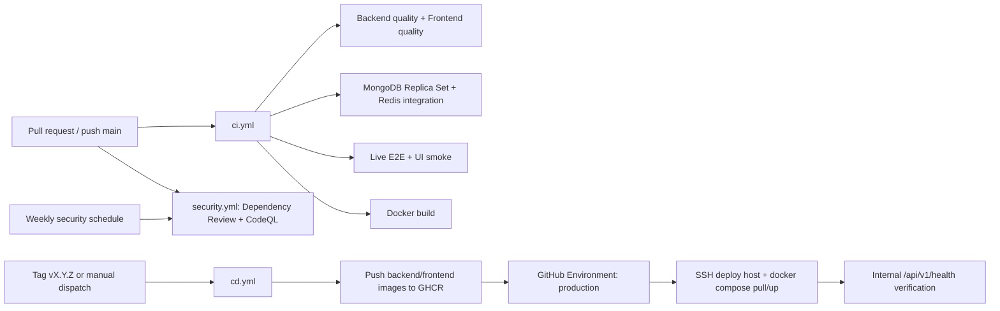

# CI/CD, Secrets và Operations Runbook

## 1. Pipeline hiện hành



### CI gates có bằng chứng

- Backend: Ruff, Mypy, compileall, `check_app.py`, `check_compose.py`, `check_api_callers.py`, pytest.
- Frontend: ESLint, Prettier, navigation check, Vitest, Vite build, Playwright UI smoke.
- Live E2E: MongoDB replica set + Redis, seed data, Uvicorn, frontend preview, Playwright.
- Security: Dependency Review trên pull request và CodeQL trên pull request/push `main`/lịch định kỳ.
- Container build: backend/frontend Docker image.

### CD có bằng chứng

- Build/push hai image lên GHCR.
- Job `deploy-production` tham chiếu GitHub Environment `production`; `APP_URL` được đọc từ Environment variable `${{ vars.APP_URL }}`. Required reviewer là protection rule trong GitHub Settings, không thể xác nhận chỉ từ workflow YAML.
- SSH secrets được dùng để deploy tới host.
- Server chạy `docker-compose.production.yml`, health check nội bộ `/api/v1/health`; `/api/health` chỉ còn là alias tương thích.
- Workflow không tự chạy Mongo migration.

## 2. Secrets và biến môi trường

Bảng dưới đây dùng đúng tên biến canonical đang được đọc bởi `backend/app/core/config.py` và được khai báo trong `.env.example`. Các giá trị production được lưu ngoài repository; tài liệu chỉ ghi tên biến và quy tắc bảo vệ.

| Tên biến | Nơi dùng | Phân loại và yêu cầu |
|---|---|---|
| `ENVIRONMENT` | Chọn policy development/production | Runtime config; production kích hoạt các validator bảo mật |
| `MONGO_URI` | FastAPI → MongoDB/Atlas | Server secret; không đưa xuống frontend hoặc log |
| `DATABASE_NAME` | Tên database runtime | Runtime config |
| `JWT_SECRET` | Ký JWT | Server secret; production tối thiểu 32 ký tự và không dùng giá trị mặc định |
| `ALGORITHM`, `JWT_EXPIRE_MINUTES` | Chính sách JWT | Runtime config |
| `AUTH_ACCESS_COOKIE_NAME`, `AUTH_CSRF_COOKIE_NAME` | Tên cookie xác thực/CSRF | Runtime config; không chứa credential |
| `AUTH_COOKIE_SECURE`, `AUTH_COOKIE_SAMESITE`, `AUTH_COOKIE_DOMAIN`, `AUTH_COOKIE_MAX_AGE` | Chính sách cookie | Runtime security config; production yêu cầu `AUTH_COOKIE_SECURE=true` khi chạy HTTPS |
| `CSRF_ENABLED` | Bảo vệ request thay đổi dữ liệu | Runtime security config |
| `LEGACY_BEARER_ENABLED`, `LEGACY_WS_QUERY_TOKEN_ENABLED`, `LEGACY_API_SUNSET` | Compatibility tạm thời | Runtime config; không phải cơ chế xác thực chính |
| `REDIS_URL` | Rate limit, idempotency, cache | Server secret/connection secret; không log giá trị |
| `RATE_LIMIT_BACKEND`, `RATE_LIMIT_ENABLED`, `RATE_LIMIT_SHADOW_MODE`, `RATE_LIMIT_ENFORCED_GROUPS`, `RATE_LIMIT_FAIL_MODE` | Chính sách rate limit | Runtime config; production phải dùng Redis và không chỉ chạy shadow mode |
| `RATE_LIMIT_DEFAULT`, `RATE_LIMIT_OPERATIONAL`, `RATE_LIMIT_HEAVY_READ`, `RATE_LIMIT_READ_HEAVY`, `RATE_LIMIT_MUTATION`, `RATE_LIMIT_LOGIN`, `RATE_LIMIT_AI`, `RATE_LIMIT_AI_CHAT`, `RATE_LIMIT_UPLOAD`, `RATE_LIMIT_UPLOAD_MUTATION`, `RATE_LIMIT_UPLOAD_SESSION`, `RATE_LIMIT_UPLOAD_COMPLETION`, `RATE_LIMIT_SCAN`, `RATE_LIMIT_DIRECTIVE`, `RATE_LIMIT_WS_HANDSHAKE` | Hạn mức theo nhóm request | Runtime config; các giá trị phải dương |
| `RATE_LIMIT_TRUSTED_PROXY_IPS`, `TRUSTED_PROXY_IPS` | Xác định proxy tin cậy | Runtime network config; chỉ khai báo IP/proxy thực sự tin cậy |
| `IDEMPOTENCY_ENABLED`, `IDEMPOTENCY_TTL_SECONDS` | Idempotency request | Runtime config; yêu cầu `REDIS_URL` hợp lệ khi bật |
| `AI_PROVIDER`, `AI_FALLBACK_PROVIDER`, `AI_MODEL`, `AI_FALLBACK_MODEL` | Chọn provider/model AI | Runtime config; production hiện xác minh provider chính là Cloudflare |
| `AI_API_KEY` | Gemini/Groq/OpenRouter nếu provider đó được chọn | Server secret; để trống khi chỉ dùng Cloudflare |
| `CLOUDFLARE_ACCOUNT_ID` | Cloudflare Workers AI adapter | Server config; không đưa xuống frontend |
| `CLOUDFLARE_API_TOKEN` | Xác thực Cloudflare API | Server secret; tuyệt đối không expose client hoặc log |
| `AI_TIMEOUT_SECONDS`, `AI_CONNECT_TIMEOUT_SECONDS`, `AI_FIRST_TOKEN_TIMEOUT_SECONDS`, `AI_IDLE_TIMEOUT_SECONDS`, `AI_TOTAL_TIMEOUT_SECONDS` | Timeout AI | Runtime reliability config |
| `AI_MAX_COMPLETION_TOKENS`, `AI_TOOL_MAX_COMPLETION_TOKENS`, `AI_SUMMARY_MAX_COMPLETION_TOKENS`, `AI_ENABLE_THINKING`, `AI_DEBUG_STREAM` | Giới hạn và chế độ sinh AI | Runtime config; không chứa secret |
| `AI_RETRY_ATTEMPTS`, `AI_RETRY_BACKOFF_SECONDS`, `AI_CIRCUIT_FAILURE_THRESHOLD`, `AI_CIRCUIT_RECOVERY_SECONDS` | Retry/circuit breaker AI | Runtime reliability config |
| `AI_SUMMARY_CONTEXT_MAX_CHARS`, `AI_SUMMARY_CACHE_TTL_SECONDS`, `AI_SUMMARY_CACHE_MAX_ENTRIES`, `AI_PROPOSAL_CACHE_TTL_SECONDS`, `AI_PROPOSAL_CACHE_MAX_ENTRIES` | Context/cache AI | Runtime performance config |
| `AI_RAG_ENABLED`, `AI_EMBEDDING_MODEL`, `AI_VECTOR_INDEX_NAME`, `AI_RAG_TOP_K`, `AI_RAG_LOCAL_FALLBACK_ENABLED` | RAG/vector search | Runtime config; vector index phải khớp Atlas khi bật |
| `CORS_ORIGINS` | FastAPI CORS | Danh sách origin cụ thể; không dùng `*` khi bật credentials |
| `STORAGE_ENDPOINT_URL`, `STORAGE_INTERNAL_ENDPOINT_URL`, `STORAGE_PUBLIC_ENDPOINT_URL` | S3/MinIO endpoint | Runtime config; production dùng endpoint phù hợp, public endpoint phải HTTPS |
| `STORAGE_BUCKET`, `STORAGE_REGION` | Bucket và region | Runtime config |
| `STORAGE_ACCESS_KEY`, `STORAGE_SECRET_KEY` | Xác thực S3/MinIO | Server secrets; production không dùng credential MinIO mặc định |
| `STORAGE_SIGNED_URL_TTL`, `STORAGE_DIRECT_UPLOAD_ENABLED`, `STORAGE_UPLOAD_URL_TTL`, `STORAGE_UPLOAD_SESSION_TTL` | Signed URL/upload | Runtime storage policy |
| `STORAGE_PUBLIC_CORS_ORIGINS` | CORS của endpoint lưu trữ public | Origin cụ thể; không dùng wildcard nếu không cần |
| `STORAGE_MAX_FILE_SIZE`, `STORAGE_MAX_FILES_PER_EVALUATION`, `STORAGE_ALLOWED_CONTENT_TYPES` | Giới hạn upload | Runtime validation config |
| `MALWARE_SCANNER_ENABLED`, `MALWARE_SCANNER_HOST`, `MALWARE_SCANNER_PORT`, `MALWARE_SCANNER_TIMEOUT_SECONDS` | Bộ quét mã độc | Runtime config; production phải bật khi dùng evidence storage |
| `BUSINESS_TIMEZONE`, `WEEKLY_EVALUATION_CUTOFF_HOUR` | Quy tắc thời gian nghiệp vụ | Runtime business config |
| `VITE_DEV_API_ORIGIN` | Vite dev proxy | Chỉ dành cho frontend development; production dùng same-origin |
| `SSH_HOST`, `SSH_USER`, `SSH_PRIVATE_KEY`, `SSH_KNOWN_HOSTS`, `DEPLOY_PATH` | GitHub Actions CD | GitHub Environment secrets/variables; không commit vào repo |
| `APP_URL` | URL deployment environment của GitHub | GitHub Environment variable |
| `AI_WORKER_BASE_URL`, `AI_WORKER_SHARED_SECRET` | Custom Worker tách riêng trong tương lai | Chưa có trong `.env.example` và chưa có Worker artifact; chỉ thêm khi phê duyệt kiến trúc Worker |

Các biến như `PATH`, `HOME`, `HOSTNAME`, `PWD`, `PYTHON_VERSION`, `PYTHON_SHA256`, `PYTHONUNBUFFERED`, `PYTHONDONTWRITEBYTECODE`, `PIP_NO_CACHE_DIR`, `GPG_KEY` là biến hệ thống/base image hoặc runtime container. Chúng có thể xuất hiện khi chạy `env`, nhưng không thuộc danh sách cấu hình ứng dụng cần quản lý trong GitHub Environment.

Không dùng tên `CLOUDFLARE_TOKEN` hoặc `VITE_API_BASE_URL` như thể chúng đã tồn tại; source hiện dùng tên ở bảng trên.

## 3. Release checklist

- [ ] CI và Security xanh trên commit release.
- [ ] `git diff --check`; không commit `.env`, token, URI hoặc build secret.
- [ ] Tag `vX.Y.Z` đã được push.
- [ ] Kiểm tra Environment `production` đã bật required reviewer trong GitHub Settings; workflow chỉ chứng minh job tham chiếu environment này.
- [ ] Server có image pull credential tối thiểu `read:packages`; thông tin credential nằm ngoài repository và cần xác minh trên EC2/GHCR.
- [ ] Backup Mongo và kiểm tra index/data integrity nếu có migration.
- [ ] Deploy image digest; lưu commit/tag/digest/config.
- [ ] Health check, login, role smoke và một nghiệp vụ read-only sau deploy.

## 4. Runbook chẩn đoán

### Backend unhealthy

```bash
docker ps
curl --fail --max-time 15 http://127.0.0.1/api/v1/health
docker compose -f docker-compose.production.yml ps backend frontend
docker compose -f docker-compose.production.yml logs --tail=200 backend
```

Lệnh `curl` trên kiểm tra Nginx/frontend proxy tại port 80. Backend production chỉ `expose` port 8000, không publish trực tiếp ra host; muốn kiểm tra backend trong container thì dùng `docker exec` trên container backend. Nếu port 80 lỗi nhưng backend container trả health `healthy`, tập trung kiểm tra frontend/Nginx, mapping port và xung đột port trên EC2.

Kiểm tra `.env.production`, Mongo URI/authSource/replica set, Redis và storage endpoint. Không in secret vào terminal/log ticket.

### Frontend/API proxy lỗi

```bash
docker compose -f docker-compose.production.yml logs --tail=200 frontend
curl --fail --max-time 15 http://127.0.0.1/
```

Kiểm tra Nginx proxy, frontend build và backend upstream. Nếu dùng domain mới, kiểm tra DNS/TLS/CORS/cookie domain.

### MongoDB/Atlas

- Kiểm tra Atlas Network Access chỉ cho phép egress IP hợp lệ.
- Kiểm tra Database User, URL-encode password, `authSource`, TLS và replica set.
- Kiểm tra Change Stream bằng staging smoke test; worker retry không thay thế việc sửa network.

### Redis/rate limit

- Production phải `RATE_LIMIT_BACKEND=redis`, `RATE_LIMIT_SHADOW_MODE=false`.
- Kiểm tra `REDIS_URL`, TLS nếu cần, kết nối và key expiry. `RATE_LIMIT_BACKEND=redis` đã được xác nhận cho production; giá trị thực tế của `RATE_LIMIT_SHADOW_MODE` cần kiểm tra trong `.env.production` trên server và phải là `false` khi rate limit được enforce.
- Không chuyển sang memory backend trên nhiều worker để “chữa” tạm production.

### AI/Cloudflare

- Kiểm tra `AI_PROVIDER`, account id/token/model và timeout budget.
- Kiểm tra log structured `provider`, `duration_ms`, `first_chunk_ms`, `error_type` do `backend/app/ai/factory.py` và `backend/app/ai/providers.py` ghi; `Settings` và `.env.example` mặc định `AI_DEBUG_STREAM=false`. Giá trị production thực tế cần xác nhận trong `.env.production` trên server; không bật raw stream debug production.
- Timeout/429/5xx phải đi qua fallback/friendly error; lỗi AI không được chặn alert/performance CRUD.
- `wrangler tail` chỉ dùng sau khi Worker riêng đã được triển khai; hiện repo chưa có workflow/source Worker để tail.

## 5. Rollback

1. Xác định tag/image digest đang chạy và commit/tag ổn định trước đó.
2. `cd.yml` hiện tự tạo `BACKEND_IMAGE`/`FRONTEND_IMAGE` từ `github.sha`, không có input image tag/digest riêng. Để rollback, chọn ref/commit ổn định cũ khi chạy `workflow_dispatch`, hoặc tạo tag release/rollback mới trỏ tới commit đó rồi push tag.
3. Chạy health, login và read-only smoke.
4. Nếu lỗi liên quan schema, không rollback database mù; xác minh backward compatibility trước.
5. Ghi commit/tag/digest, nguyên nhân, thời điểm, kết quả và kế hoạch corrective action vào change record/`CHANGELOG.md`.
## 6. Incident Response & Reliability

Phần bổ sung đang được hoàn thiện theo source fact và policy đề xuất.
### 6.1 Secret rotation policy

Repository hiện chưa chứa cadence, tên người thực hiện hoặc change record system cho secret rotation. Baseline dưới đây là policy đề xuất để owner production phê duyệt trước khi áp dụng.

| Secret | Cadence đề xuất | Rotate ngay khi | Hệ quả đã xác nhận/suy ra từ hệ thống | Owner cần gán |
|---|---|---|---|---|
| JWT_SECRET | Mỗi 90 ngày hoặc theo security review | Nghi lộ, commit/log chứa secret, người có quyền rời team | Các JWT đã ký bằng secret cũ không còn xác thực được; user phải đăng nhập lại | Security/backend owner |
| SSH_PRIVATE_KEY | Mỗi 90 ngày hoặc khi mất/nghi lộ máy giữ key | Máy giữ private key bị mất hoặc key lộ | CD mất quyền SSH cho tới khi cập nhật đồng thời GitHub Environment secret và authorized_keys trên server | Infra/release owner |
| CLOUDFLARE_API_TOKEN | Mỗi 90 ngày hoặc theo Cloudflare policy | Token lộ trong log/commit hoặc account nghi bị truy cập | AI provider có thể lỗi cho tới khi cập nhật token; phải revoke token cũ trên Cloudflare | AI/platform owner |
| MONGO_URI | Theo rotation policy của Atlas, tối đa 90 ngày nếu chưa có policy riêng | Nghi lộ hoặc thay Database User/password | Phải cập nhật Atlas Database User và .env.production phối hợp; sai thứ tự có thể làm backend mất kết nối DB | Database owner |
| REDIS_URL | Theo rotation policy của Redis, tối đa 90 ngày nếu chưa có policy riêng | Nghi lộ hoặc thay credential/endpoint | Rate limit/idempotency có thể không sẵn sàng; hành vi fail-open/fail-closed phụ thuộc cấu hình | Platform owner |
| STORAGE_ACCESS_KEY/STORAGE_SECRET_KEY | Theo policy S3/MinIO, tối đa 90 ngày nếu chưa có policy riêng | Credential lộ hoặc provider yêu cầu revoke | Upload/signed URL có thể lỗi trong thời gian chuyển đổi; cần upload/download smoke test | Storage owner |

Quy trình tối thiểu cho mọi lần rotate:

1. Tạo change record không chứa giá trị secret; ghi secret nào, lý do, người thực hiện, thời điểm và cửa sổ ảnh hưởng.
2. Chuẩn bị credential mới và kiểm tra quyền tối thiểu ở provider tương ứng.
3. Cập nhật nguồn thật của runtime theo mục 6.2, restart/recreate service có kiểm soát.
4. Chạy health, login/role smoke và smoke riêng cho AI, Redis hoặc upload tùy secret.
5. Chỉ revoke secret cũ sau khi runtime mới đã được xác minh; cập nhật evidence và CHANGELOG.

JWT_SECRET là thay đổi có ảnh hưởng phiên đăng nhập toàn hệ thống; không rotate giữa giờ cao điểm nếu chưa thông báo và chuẩn bị luồng đăng nhập lại.

### 6.2 Nguồn thật của secret trên production

Đã xác nhận từ workflow và compose:

- docker-compose.production.yml đọc .env.production trực tiếp trên host qua env_file.
- cd.yml chỉ truyền BACKEND_IMAGE, FRONTEND_IMAGE và SSH deploy variables vào lệnh SSH; không có bước SCP/rsync .env.production từ GitHub.
- GitHub Environment production đang cung cấp các biến/secrets phục vụ CD như APP_URL, SSH_HOST, SSH_USER, SSH_PRIVATE_KEY, SSH_KNOWN_HOSTS và DEPLOY_PATH; workflow không chứng minh các application secrets trong bảng mục 2 được tự động đồng bộ sang server.
- docs/deployment/ci-cd.md hướng dẫn tạo .env.production trên server và đăng nhập GHCR riêng với quyền read:packages.

Vì vậy, nguồn thật hiện hành của application runtime là file .env.production trên server, được quản trị ngoài repository và ngoài bước deploy image. Repo chưa xác nhận file này được sinh tự động từ GitHub Environment, có version/audit trail ngoài server hay có bản backup khôi phục được khi mất host.

Quy trình thay đổi bắt buộc:

1. Mở change record, không dán giá trị secret.
2. Cập nhật .env.production trên server qua kênh SSH được kiểm soát hoặc cơ chế secret manager được owner phê duyệt.
3. Kiểm tra quyền file và syntax compose; không lưu hoặc in output có thể chứa giá trị secret, rồi recreate service cần thiết.
4. Chạy health và smoke theo mục 6.1.
5. Ghi hash/version của change record, thời điểm và kết quả; không commit .env.production.

Owner, quyền SSH, nơi backup mã hóa của .env.production và quy trình khôi phục hiện **chưa được xác nhận trong repository**. Không coi việc secret tồn tại trong GitHub Environment là bằng chứng server đã nhận secret đó.

### 6.3 Health-check failure sau deploy

CD hiện chạy một chuỗi lệnh SSH bằng toán tử &&: pull image, compose up rồi curl /api/v1/health. Lệnh curl dùng --retry 12, --retry-all-errors, --retry-delay 5 và --max-time 15.

Nếu health vẫn fail:

- GitHub Actions step trả lỗi và deployment job không được coi là thành công.
- Không có bước rollback tự động trong .github/workflows/cd.yml.
- Container mới có thể vẫn đang chạy trên server; workflow không tự đưa image cũ trở lại.
- Người vận hành phải đánh giá log/health rồi rollback thủ công theo mục 5, chọn ref/image cũ và chạy lại compose.

Quy tắc xử lý:

1. Giữ lại workflow run, commit/tag/digest và thời điểm bắt đầu.
2. Kiểm tra docker compose ps, backend/frontend logs và health qua Nginx port 80.
3. Nếu lỗi là image/config và bản cũ tương thích, rollback image cũ; không rollback database mù.
4. Chạy lại health, login và read-only smoke.
5. Ghi nguyên nhân, quyết định rollback và corrective action vào change record.

Ngưỡng bắt buộc rollback tự động, kênh cảnh báo và SLA hiện chưa được cấu hình. Baseline đề xuất: sau khi hết chu kỳ retry health hoặc khi P1 được xác định, Infra/Release owner phải quyết định rollback trong 15 phút.

### 6.4 Quy trình Mongo migration

CD không chạy migration. Các script migration hiện có trong repository là:

| Script | Phạm vi | Tính chất đã xác nhận |
|---|---|---|
| backend/scripts/migrate_drop_legacy_coordination_index.py | Drop index unique alert_id_1 trên coordination_directives | Kết nối Mongo bằng MONGO_URI, ping trước, kiểm tra đúng index/unique, drop index, xác nhận document count không đổi và index đã biến mất |
| backend/scripts/migrate_drop_directed_task_once_index.py | Drop index directed_task_once_unique trên department_task_directives | Kết nối Mongo bằng MONGO_URI, kiểm tra đúng index/unique, drop index, xác nhận document count không đổi và index đã biến mất |

Quy trình hiện hành được ghi trong README.md và docs/deployment/ci-cd.md:

1. Backup database.
2. Chạy script trên staging.
3. Kiểm tra index và data integrity.
4. Duyệt release production.
5. Chạy migration idempotent trên production bằng lệnh có kiểm soát.
6. Ghi script, thời điểm, người chạy, output và kết quả vào change record/CHANGELOG.

Các script này có nhánh “đã vắng mặt” để chạy lại an toàn ở mức script, nhưng không có migration registry, transaction bao quanh toàn bộ quy trình hoặc lệnh down/revert trong repository. Nếu script fail giữa chừng, không có rollback tự động; index migration không xóa document theo logic script nhưng cần kiểm tra lại index/data integrity trước khi tiếp tục. Service version đang chạy trong thời điểm chạy migration phải được ghi rõ trong change record; với thay đổi schema tương lai, bắt buộc dùng chiến lược backward-compatible expand/contract.

Owner chạy migration, cửa sổ production, lệnh production cụ thể và bằng chứng restore backup **chưa được gán/xác nhận trong repository**.
### 6.5 Incident severity và escalation

Bảng dưới là baseline đề xuất, chưa phải SLA đã được tổ chức phê duyệt:

| Mức | Định nghĩa | Ví dụ | Phản hồi đề xuất | Escalate tới |
|---|---|---|---|---|
| P1 — Critical | Toàn hệ thống down, mất dữ liệu hoặc rủi ro bảo mật đang diễn ra | Health fail liên tục, Mongo không truy cập, credential lộ | 15 phút, cập nhật mỗi 30 phút | On-call Infra + Backend lead + owner bảo mật |
| P2 — High | Một luồng core hỏng nhưng hệ thống còn sử dụng được | Login, upload, performance write hoặc AI production hỏng diện rộng | 1 giờ, cập nhật mỗi 2 giờ | Domain owner + Infra on-call |
| P3 — Medium | Suy giảm một phần, có workaround | Rate limit lệch, WebSocket chậm, một nhóm query lỗi | Trong ngày làm việc | Domain owner |
| P4 — Low | Lỗi nhỏ, không ảnh hưởng luồng chính | Alias compat hoặc nội dung log chưa tối ưu | 3 ngày làm việc | Product/backlog owner |

Kênh escalation, số điện thoại/email nhóm và người on-call thực tế chưa được lưu trong repository. Không điền tên/kênh giả vào runbook; cần bổ sung ở mục 8 trước khi coi đây là runbook dùng trực đêm.

### 6.6 Monitoring và alerting

Repository hiện chỉ có health endpoint, Docker healthcheck, log container và hướng dẫn thủ công. Không tìm thấy cấu hình uptime monitor, log aggregation, CloudWatch/Grafana/Loki hoặc notification channel trong workflow/compose.

Các monitor tối thiểu cần cấu hình ngoài repository:

| Monitor | Ngưỡng baseline đề xuất | Hành động |
|---|---|---|
| Uptime /api/v1/health qua domain/Nginx | 2 lần fail liên tiếp | Tạo P1 và gọi Infra on-call |
| HTTP 5xx | >5% trong 5 phút hoặc tăng đột biến | Tạo P1/P2 tùy phạm vi, xem logs |
| Container restart/unhealthy | Bất kỳ restart lặp hoặc unhealthy quá 2 phút | Tạo P1/P2 |
| EC2 CPU/memory/disk | >80% cảnh báo, >90% khẩn cấp | Kiểm tra capacity/log rotation |
| Mongo/Redis connection error | Liên tiếp trong 2 phút | Escalate Database/Platform owner |
| Storage/ClamAV failure | 3 lỗi liên tiếp hoặc scanner unavailable | Tạm dừng upload evidence và gọi Storage owner |
| AI first-token/timeout/error | Vượt budget hoặc fallback tăng bất thường | Gọi AI owner; xác nhận CRUD không bị ảnh hưởng |

Các ngưỡng trên là đề xuất cần xác nhận bằng metric production. Health check đơn lẻ không chứng minh uptime ngoài giờ, p95, error rate hay alert delivery.

### 6.7 Backup và Disaster Recovery

Evidence trước đây đã xác nhận backup/PITR MongoDB Atlas ở mức owner-provided, nhưng repository không ghi cadence, retention, vị trí backup cụ thể, ngày restore test gần nhất, RTO hoặc RPO. Storage bucket và .env.production cũng chưa có quy trình backup/restore được ghi đầy đủ.

Baseline đề xuất để owner phê duyệt:

| Tài sản | Tần suất/retention đề xuất | Restore test bắt buộc |
|---|---|---|
| MongoDB Atlas | Snapshot hằng ngày, retention tối thiểu 30 ngày; PITR theo gói dịch vụ | Hàng tháng trên project/database cô lập; kiểm tra document count, index, ứng dụng read-only |
| Storage evidence | Versioning/lifecycle theo provider, backup hằng ngày hoặc replication nếu dữ liệu quan trọng | Hàng tháng tải thử một object và kiểm tra checksum/MIME |
| .env.production/config | Bản backup mã hóa sau mỗi thay đổi, không lưu plaintext trong Git | Quarterly hoặc sau thay đổi hạ tầng; kiểm tra khôi phục mà không in secret |
| Release metadata | Mỗi release lưu commit/tag/digest/config reference | Kiểm tra rollback image trên staging |

Restore test phải ghi ngày, người thực hiện, nguồn backup, môi trường đích, kết quả và bằng chứng đã che secret. Backup chưa test restore không được đánh dấu là DR đã đạt.

RTO/RPO production hiện chưa được owner xác nhận. Baseline đề xuất cho team quy mô vừa: RTO 4 giờ, RPO 24 giờ cho dữ liệu nghiệp vụ; cần điều chỉnh theo yêu cầu tổ chức.

### 6.8 Deploy strategy và downtime

Production hiện dùng một host với docker compose pull rồi docker compose up -d --remove-orphans. Đây là single-host recreate/update strategy, không phải rolling hoặc blue-green. Frontend phụ thuộc backend healthy nên compose có thể chờ backend trước khi khởi động frontend.

Repository chưa có phép đo downtime thực tế. Vì container có thể bị recreate và frontend có thể unavailable trong lúc restart, downtime hiện được coi là **chưa đo**, không được ghi là “vài giây” như một cam kết.

Cho tới khi có blue-green/rolling:

- Deploy trong cửa sổ tải thấp và thông báo trước cho owner nghiệp vụ.
- Ghi timestamp trước/sau, thời gian health fail nếu có và kết quả smoke.
- Xem đây là known limitation của single-host deployment.
- Không tuyên bố zero-downtime nếu chưa có runtime evidence.

## 7. Ownership và Access Control

Workflow chứng minh tên quyền cần có nhưng không chứng minh ai đang giữ quyền. Bảng dưới phải được điền từ GitHub Settings, EC2, Atlas, Cloudflare và storage console; không ghi secret hoặc private key vào tài liệu.

| Quyền hạn/tài sản | Trạng thái đã xác nhận | Owner cần chỉ định | Cấp/rút quyền |
|---|---|---|---|
| Required reviewer của GitHub Environment production | Workflow tham chiếu environment; danh sách reviewer chỉ nằm trong GitHub Settings | Release owner + reviewer cá nhân | GitHub Settings → Environments; review định kỳ và revoke khi đổi vai trò |
| SSH_PRIVATE_KEY và authorized_keys trên EC2 | Workflow dùng GitHub Environment secret; người giữ bản gốc chưa xác nhận | Infra owner | Rotate key, cập nhật secret và authorized_keys trong cùng change |
| GHCR read:packages trên EC2 | docs yêu cầu credential tối thiểu read:packages; chủ credential chưa xác nhận | Infra/release owner | Revoke token cũ, cấp token read-only mới và kiểm tra docker pull |
| Atlas Database User/Network Access | Production Atlas/RBAC đã có owner-provided evidence; danh sách admin chưa lưu repo | Database owner | Provider IAM/database user, review allowlist và revoke access |
| Cloudflare account/API token | Backend dùng CLOUDFLARE_API_TOKEN; người quản trị account chưa xác nhận | AI/platform owner | Cloudflare dashboard/API token scopes; rotate/revoke |
| Domain/DNS/TLS | Domain chính thức chưa cấu hình đầy đủ trong repo | Infra/domain owner | DNS provider, certificate renewal và access review |
| S3/MinIO console | Storage config có trong Settings; người giữ console access chưa xác nhận | Storage owner | IAM least privilege, access key rotation và revoke |

Trước mỗi release, required reviewer phải xác nhận artifact image/tag/digest và rollback reference. Khi offboarding, revoke GitHub, SSH, GHCR, Atlas, Cloudflare và storage access trong cùng checklist; không chỉ xóa GitHub user.

## 8. On-call theo domain

Repository chưa có on-call rotation hoặc contact channel. Các vai trò dưới đây là ownership baseline, không phải tên người đã được xác nhận:

| Domain | Primary cần gán | Backup cần gán | Kênh cần gán |
|---|---|---|---|
| Backend/API | Backend/API owner | Platform backup | Incident channel + phone escalation |
| Database Mongo/Atlas | Database owner | Backend/platform backup | Provider alert + incident channel |
| Infra/Deploy EC2, Docker, CI/CD | Infra/release owner | Backend/platform backup | Pager/phone escalation |
| AI/Cloudflare | AI/platform owner | Backend backup | Incident channel |
| Frontend/Nginx | Frontend owner | Infra backup | Incident channel |
| Secrets/Security | Security owner | Release owner | Private security channel |

Runbook chỉ được coi là **production-actionable** sau khi mỗi dòng có tên primary, backup, kênh liên hệ và SLA đã phê duyệt. Hiện các trường này vẫn là quyết định tổ chức chưa có trong repository.

## 9. Closure checklist

- [ ] Đã có secret rotation cadence, owner và change record location.
- [ ] Đã xác định nguồn thật, backup mã hóa và restore path của .env.production.
- [ ] Đã quyết định health failure: rollback tự động hay thủ công, cùng SLA và escalation.
- [ ] Đã chỉ định migration owner, cửa sổ chạy, staging evidence và production command.
- [ ] Đã phê duyệt P1–P4, kênh escalation và SLA.
- [ ] Đã cấu hình uptime/log/infra/database alert ngoài giờ.
- [ ] Đã ghi backup cadence, retention, RTO/RPO và restore test gần nhất.
- [ ] Đã đo downtime hoặc ghi nhận rõ giới hạn single-host recreate.
- [ ] Đã điền reviewer, SSH/GHCR/Atlas/Cloudflare/storage owner.
- [ ] Đã điền primary/backup/kênh cho mọi domain on-call.

## 10. Changelog

| Ngày | Thay đổi | Nguồn/kiểm chứng |
|---|---|---|
| 2026-09-16 | Bổ sung secret rotation, nguồn thật .env.production, health failure handling, Mongo migration procedure, severity/escalation, monitoring, backup/DR, downtime, access ownership và on-call theo domain. Phân biệt source fact với baseline đề xuất và quyết định tổ chức còn mở. | Đối chiếu .github/workflows/cd.yml, docker-compose.production.yml, docs/deployment/ci-cd.md, README.md, backend/scripts/migrate_*.py, GitHub Environment wiring và evidence backup/PITR đã ghi trong tài liệu Mongo. |
