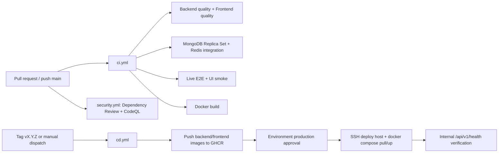

# CI/CD, Secrets và Operations Runbook

## 1. Pipeline hiện hành



### CI gates có bằng chứng

- Backend: Ruff, Mypy, compileall, `check_app.py`, `check_compose.py`, `check_api_callers.py`, pytest.
- Frontend: ESLint, Prettier, navigation check, Vitest, Vite build, Playwright UI smoke.
- Live E2E: MongoDB replica set + Redis, seed data, Uvicorn, frontend preview, Playwright.
- Security: Dependency Review và CodeQL.
- Container build: backend/frontend Docker image.

### CD có bằng chứng

- Build/push hai image lên GHCR.
- `APP_URL` là GitHub Environment variable cho deployment URL.
- SSH secrets được dùng để deploy tới host.
- Server chạy `docker-compose.production.yml`, health check nội bộ.
- Workflow không tự chạy Mongo migration.

## 2. Secrets và biến môi trường

| Tên | Nơi dùng | Phân loại |
|---|---|---|
| `MONGO_URI` | FastAPI → MongoDB/Atlas | Server secret; không đưa frontend |
| `DATABASE_NAME` | FastAPI | Runtime config |
| `JWT_SECRET` | JWT signing | Secret ≥ 32 ký tự production |
| `AUTH_COOKIE_*`, `CSRF_ENABLED` | Auth/cookie | Runtime security config |
| `REDIS_URL` | rate limit/idempotency/cache | Server secret/connection secret |
| `CLOUDFLARE_ACCOUNT_ID` | Cloudflare adapter | Server config |
| `CLOUDFLARE_API_TOKEN` | Cloudflare API auth | Secret; không expose client |
| `AI_API_KEY` | provider Groq/Gemini/OpenRouter nếu chọn | Secret |
| `AI_PROVIDER`, `AI_FALLBACK_PROVIDER`, model/timeouts | provider policy | Runtime config |
| `STORAGE_*` | S3/MinIO/signed URL | Access/secret + endpoint config |
| `MALWARE_SCANNER_*` | scanner | Runtime config |
| `CORS_ORIGINS` | FastAPI CORS | Public origin allowlist |
| `VITE_DEV_API_ORIGIN` | Vite dev proxy | Frontend dev config; production same-origin |
| `SSH_HOST`, `SSH_USER`, `SSH_PRIVATE_KEY`, `SSH_KNOWN_HOSTS`, `DEPLOY_PATH` | GitHub Actions CD | GitHub Environment secrets |
| `APP_URL` | GitHub Actions deployment environment URL | GitHub Environment variable |
| `AI_WORKER_BASE_URL`, `AI_WORKER_SHARED_SECRET` | future Worker split | Chưa có trong `.env.example`; cần bổ sung nếu chọn Worker riêng |

Không dùng tên `CLOUDFLARE_TOKEN` hoặc `VITE_API_BASE_URL` như thể chúng đã tồn tại; source hiện dùng tên ở bảng trên.

## 3. Release checklist

- [ ] CI và Security xanh trên commit release.
- [ ] `git diff --check`; không commit `.env`, token, URI hoặc build secret.
- [ ] Tag `vX.Y.Z` đã được push.
- [ ] Environment `production` có required reviewer.
- [ ] Server có image pull credential tối thiểu `read:packages`.
- [ ] Backup Mongo và kiểm tra index/data integrity nếu có migration.
- [ ] Deploy image digest; lưu commit/tag/digest/config.
- [ ] Health check, login, role smoke và một nghiệp vụ read-only sau deploy.

## 4. Runbook chẩn đoán

### Backend unhealthy

```bash
docker ps
curl --fail --max-time 15 http://127.0.0.1/api/v1/health
docker logs --tail=200 workmind-backend-1
```

Kiểm tra `.env.production`, Mongo URI/authSource/replica set, Redis và storage endpoint. Không in secret vào terminal/log ticket.

### Frontend/API proxy lỗi

```bash
docker logs --tail=200 workmind-frontend-1
curl --fail --max-time 15 http://127.0.0.1/
```

Kiểm tra Nginx proxy, frontend build và backend upstream. Nếu dùng domain mới, kiểm tra DNS/TLS/CORS/cookie domain.

### MongoDB/Atlas

- Kiểm tra Atlas Network Access chỉ cho phép egress IP hợp lệ.
- Kiểm tra Database User, URL-encode password, `authSource`, TLS và replica set.
- Kiểm tra Change Stream bằng staging smoke test; worker retry không thay thế việc sửa network.

### Redis/rate limit

- Production phải `RATE_LIMIT_BACKEND=redis`, `RATE_LIMIT_SHADOW_MODE=false`.
- Kiểm tra `REDIS_URL`, TLS nếu cần, kết nối và key expiry.
- Không chuyển sang memory backend trên nhiều worker để “chữa” tạm production.

### AI/Cloudflare

- Kiểm tra `AI_PROVIDER`, account id/token/model và timeout budget.
- Kiểm tra log structured `provider`, `duration_ms`, `first_chunk_ms`, `error_type`; không bật raw stream debug production.
- Timeout/429/5xx phải đi qua fallback/friendly error; lỗi AI không được chặn alert/performance CRUD.
- `wrangler tail` chỉ dùng sau khi Worker riêng đã được triển khai; hiện repo chưa có workflow/source Worker để tail.

## 5. Rollback

1. Xác định tag/image digest đang chạy và tag ổn định trước đó.
2. Qua approval, chạy lại deploy với `BACKEND_IMAGE`/`FRONTEND_IMAGE` của tag cũ.
3. Chạy health, login và read-only smoke.
4. Nếu lỗi liên quan schema, không rollback database mù; xác minh backward compatibility trước.
5. Ghi commit/tag/digest, nguyên nhân, thời điểm, kết quả và kế hoạch corrective action vào change record/`CHANGELOG.md`.
